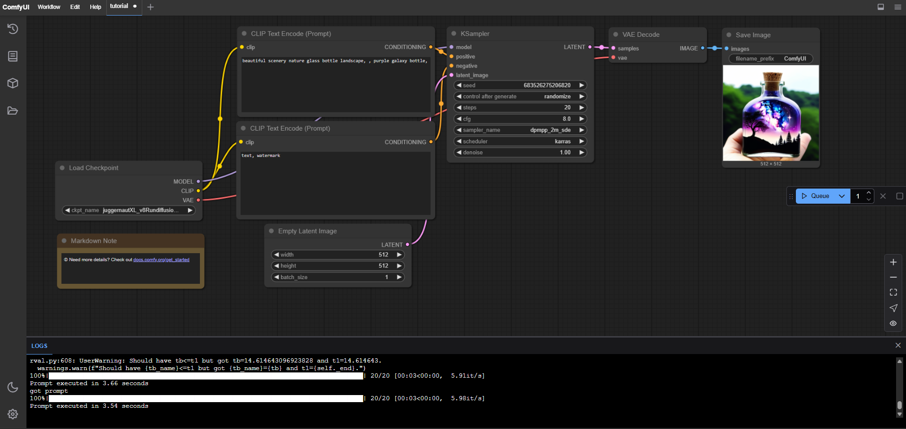
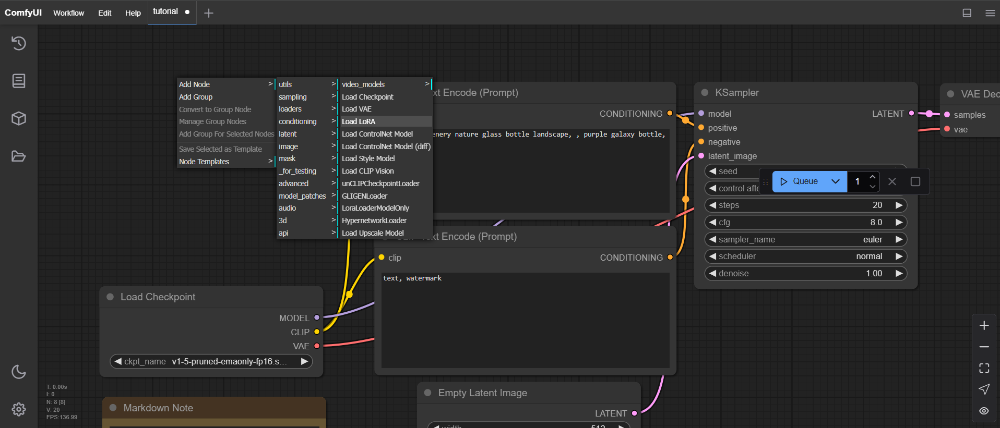
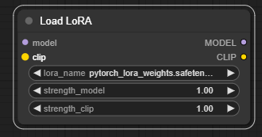
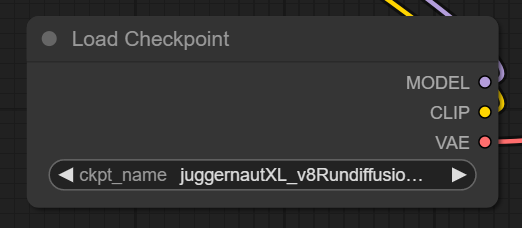
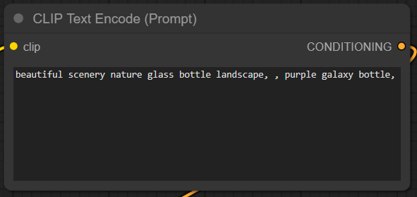
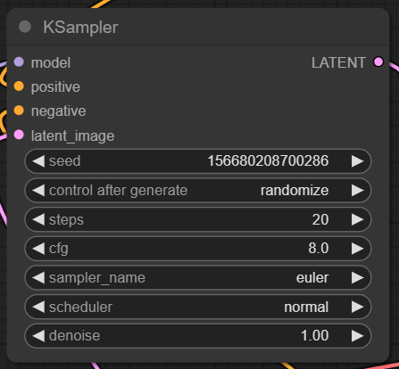
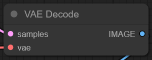
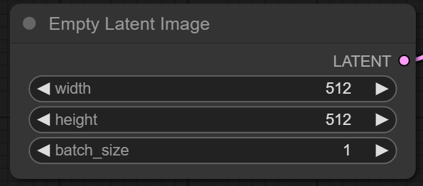
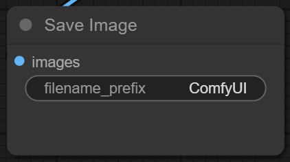

# ConfyUI

Confy UI is a user interface that allows you to generate images and videos from text descriptions using Flux models or Stable Diffusion models. It is a very complex and powerful interface that you can use to generate images and videos with Flux models or Stable Diffusion models.

Donwnload [Confy UI on GitHub](https://github.com/comfyanonymous/ComfyUI?tab=readme-ov-file)

as the others UIs you see that the parameters in essence are the same to generate images, the only diferrence is that you can combine workflows to generate images and videos. The others UIs are similar to only one workflow.

## Confy UI interface

The interface is divided into 4 main sections:
- Top Menu: where you can open, browse, save, export, and import workflows. You can also see the version of the interface, the documentation and the current workflow.
- Sidebar: At left, where you can select, Workflows, Models (loras, checkpoints e etc), Toggle theme and settings.
- Main: Where you create you workflow, that is composed by nodes and connections between them. You can add nodes, remove nodes, connect nodes, disconnect nodes, and run the workflow. There is a lot of types of nodes that you can use to generate images and videos.
- Console: Where you can see the logs of the workflow and the output of the images or videos generated.

## Workflows
A workflow is a sequence of nodes that you can use to generate images and videos. You can create a new workflow, open a workflow, save a workflow, export a workflow, and import a workflow.

Lets take in account a simple workflow that generates images from text descriptions using a lora.

### Explain nodes
Each node has a specific function and can be used to generate images and videos.\

#### Add Node
In a free space in the main section, right click and select `Add Node` and then select `loaders` and Load `Lora`.\

Now, you can see the `lora` node in the main section.\

#### Lora Node
The `lora` node that can be used to improve the quality of the images generated.\

To add a connection between the `lora` node and another node, you have 2 entries called `model` and `clip`.\
and to exits can be `MODEL` and `CLIP`, yes with capital letters.

#### Load Checkpoint Node
\
The `Load Checkpoint` node where you can load a model to generate images or videos. for example, you can load a model from the `JuggernaultXL` model. This node has no entries only exits, `MODEL`, `CLIP` and `VAE`.

If we dont want yo use loras ou can connect this node directly to the `KSampler node` node, otherwise you can connect the `lora` node to the `KSampler node` node.
then the `MODEL` exit of the `Load Checkpoint` node to the `model` entry of the `lora` node and the `MODEL` exit of the `lora` node to the `model` entry of the `KSampler node` node. Then `CLIP` exit of the `Load Checkpoint` node to the `clip` entry of the `lora` node and the `CLIP` exit of the `lora` node to the `clip` entry of the `Clip Text Encode(prompt) node` that is the positice `prompt` and to the `Clip Text Encode(prompt) node` that is the negative `prompt`.

#### Text Prompt Node
\
The `Text Prompt` node where you can add a text prompt to generate images or videos. This node has 1 entry, `clip` and 1 exit, `CONDITIONING` that is connected to the `KSampler node` node in `positive` or `negative` entries. If connected to the `positive` entry, the text prompt will be positive, if connected to the `negative` entry, the text prompt will be negative.

#### KSampler Node
\
The `KSampler` node where you can generate images or videos. This node has 4 entries, `model` and `positive`, `negative` and `latent_image`, that comes from `Latent Image` node and only one 1 exit, `LATENT`, that is connected to the `VAE Decode` node.

#### VAE Decode Node
\
The `VAE Decode` node where you can decode the latent image to generate images or videos. This node has 2 entries, `samples` that comes from `KSampler` `LATENT` exit and `vae` that comes from `Load Checkpoint` `VAE`, and 1 exit, `IMAGE`, that is connected to the `Save Image` node.

#### Latent Image Node
\
The `Latent Image` node where you put the settings of the image to be generated. This node has no entry, only one exit, `LATENT`, that is connected to the `KSampler` `latent_image` entry.

#### Save Image Node
\
The `Save Image` node where you can save the image generated. This node has 1 entry, `image` that comes from `VAE Decode` `IMAGE` and no exits.

## ConfyUI manager
[ConfyUI manager](https://github.com/ltdrdata/ComfyUI-Manager) is a tool that allows you to manage your workflows, models, and checkpoints. You can use it to create, edit, delete, and export workflows, models, and checkpoints. You can also use it to import workflows, models, and checkpoints.

Check the documentation of for more instructions on how to use it.

### ConfyUI manager Colab with confyUI manager
[ConfyUI manager Colab](https://colab.research.google.com/github/ltdrdata/ComfyUI-Manager/blob/main/notebooks/comfyui_colab_with_manager.ipynb) is a Colab notebook that allows you to use ConfyUI manager in Colab. You can use it to create, edit, delete, and export workflows, models, and checkpoints in Colab. You can also use it to import workflows, models, and checkpoints in Colab.

### ConfyUI Custom nodes
you can install custom nodes and other this via ConfyUI manager. 
Open confyui manager, go to `Custom Nodes Manager`  and search for the repo name, or browser in the list of repos. Then click in the `install` button to install the custom node.\

[comfyui_examples](https://comfyanonymous.github.io/ComfyUI_examples/)

[ConfyUi GGUF(quntitized modules)](https://github.com/city96/ComfyUI-GGUF)

[simple workflow for flux, includind quntitized modules](https://civitai.com/models/664346?modelVersionId=743498)

[Open art workflows](https://openart.ai/workflows/home)

[XLabs Nodes for Confy](https://github.com/XLabs-AI/x-flux-comfyui)

#### Flux ControlNets

[flux controlnets collection](https://huggingface.co/XLabs-AI/flux-controlnet-collections)

ControlNets allow precise control over image generation by conditioning the model on additional inputs like depth maps, edge maps, or pose estimations. This ensures that the generated image adheres to specific structural or compositional guidelines.\

Ideal for scenarios where maintaining specific structural elements is crucial, such as preserving the depth in landscapes or ensuring accurate poses in character generation.\

This collection of controlnets is similar to the Fooocus,
1. Canny ControlNet – Edge Detection (Basic & Strong)
* What it does: Detects strong edges in an image (like an outline or a stencil).
* How it works: It converts an image into black & white edges, keeping only the most prominent lines.
* Best for:\
✅ Sharp outlines (like comic book art or blueprints)\
✅ Turning simple sketches into detailed images\
✅ Maintaining clear shapes in AI generations

* Example:

You draw a rough stick figure → AI follows it to generate a full, detailed person.

You trace the shape of a car → AI keeps the structure while adding realistic textures.

2. Depth ControlNet – 3D Perspective & Distance
* What it does: Understands how close or far objects are in an image.
* How it works: It converts an image into a depth map, where closer things are lighter and farther things are darker.
* Best for:\
✅ Keeping proper perspective in an image\
✅ Ensuring backgrounds stay behind and foregrounds stay in front\
✅ Turning flat images into 3D-like art

* Example:

You have a photo of a person in front of a city → AI keeps the person in focus and the city in the background.

You want to change the style of an image (realistic → anime) but keep the depth structure the same.

3. HED ControlNet – Soft & Detailed Edge Detection
* What it does: Detects both soft and sharp edges, capturing more details than Canny.
* How it works: It finds all the important lines, even subtle ones, while ignoring background noise.
* Best for:\
✅ Turning line art or sketches into colored images\
✅ Preserving detailed contours in AI-generated art\
✅ Great for anime, illustrations, and soft shading

* Example:

You have an anime sketch with fine details → AI colors it while keeping the original linework intact.

You want to stylize a real photo but keep smooth, flowing edges instead of rough outlines.

Quick Comparison
ControlNet	What It Controls	Best For
Canny	Strong, clear edges (sharp lines)	Sketches, blueprints, strong outlines
Depth	3D structure & distance (near vs. far)	Realistic depth, maintaining perspective
HED	Detailed, soft edges (smooth lines)	Anime, soft contours, preserving fine details
So, in short:

Canny → Bold & clear edges

Depth → Distance & 3D feel

HED → Smooth, detailed edges

#### IP Adapters
IP Adapters enable image prompt capabilities, allowing the model to extract and apply specific visual elements from reference images to new AI-generated content.​\

Useful for style transfer, where the goal is to generate new images that embody the aesthetic qualities of a reference image, such as its color scheme or artistic style.\

[Flux IP Adapters](https://github.com/XLabs-AI/x-flux-comfyui?tab=readme-ov-file#ip-adapter)

**NOTE: Ip Adapters are great for style transfer, where the goal is to generate new images that embody the aesthetic qualities of a reference image, such as its color scheme or artistic style. But in Flux at least, take too long to generate images. so In the opinion of the author, it is not worth using it. It is better to train a lora to achieve the same result.**

[open model db](https://openmodeldb.info)
[Spscalers](https://openmodeldb.info/?t=general-upscaler)

## Face swap
[Instant ID on github](https://github.com/cubiq/ComfyUI_InstantID)

## Animation and video generation
[Live portrait on github](https://github.com/kijai/ComfyUI-LivePortraitKJ)\
[Toon Crafter on github](https://github.com/Doubiiu/ToonCrafter)\
[Mimic Motion on github](https://github.com/AIFSH/ComfyUI-MimicMotion)\
[Aninamate anyone involved on github](https://github.com/MrForExample/ComfyUI-AnimateAnyone-Evolved)\
[Deforum Flux models on github](https://github.com/XLabs-AI/deforum-x-flux)\
[Deforum SD modles on github](https://github.com/deforum-art/deforum-stable-diffusion)