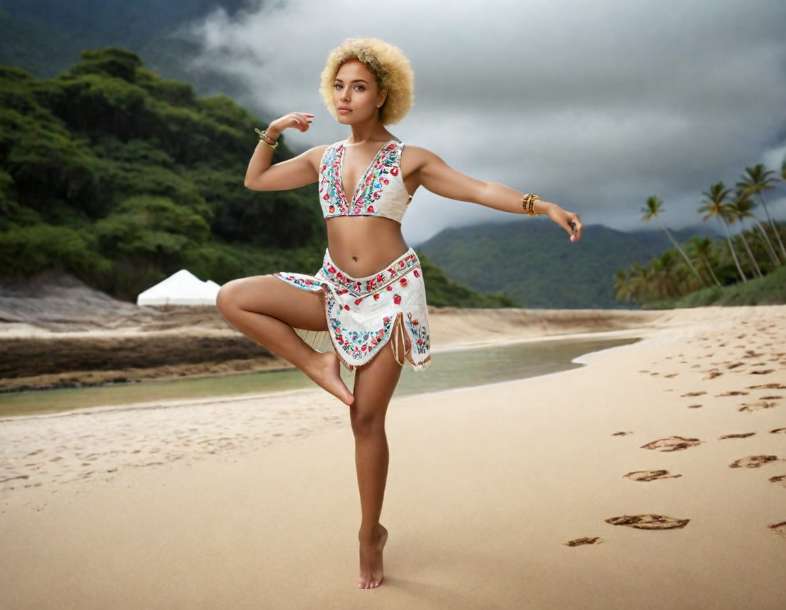

# Input Image settings

## Upscale or Variation
as in the enhance settings, you can change the upscale or variation of the image. You can select the upscale or variation that you want to use in the radio buttons.

## Image Prompt
You can upload an image to generate the image. You can upload the image by clicking on the button.

### Image prompt parameters

* StopAt - It is how much the AI will take in account the prompted in a determined number of steps. 1 is 100% and 0 is 0%. It means that the AI will generate same style of the image prompted at the specified percentage of steps.
  
* Weight - It is how accurated the AI will generate the image prompted in a determined number of steps (higher the number less creative the AI will be). it is a number between 0 and 2. The higher the number, the more accurate the AI will generate the image prompted.

**NOTE: Weight higher then 1.3 will start to mess up the image, feel free to test it.**
  
* #### Generating methods:
  * Image prompt - An image prompt is a way to generate an image with the same style as the image prompted. 
  * PyraCanny controlNet- Pose to image generation method.
  * CPDSA - You can use the CPDSA method to generate the image.
  * FaceSwap - You can use the FaceSwap method to generate the image.

#### Image prompt method

- Sample 1:

**Original prompt: `woman`**

| Original image                                  | Image prompt - StopAt:1, Weight:1                 |
| ----------------------------------------------- | ------------------------------------------------- |
|  |  |

As you can see, the image generated is almost the same as the image prompted, at least in the style of the image.

- Sample 2:

**Original prompt: `asian man`**

| Original image                                  | Image prompt - StopAt:1, Weight:0.75               |
| ----------------------------------------------- | -------------------------------------------------- |
|  |  |

Even with change of gender, in the text prompt, the image generated is almost the same as the image prompted, at least in the style of the image. Of course we had to decrease the weight to 0.75 to get this result.
Weight at 0.8 or more will not take the prompt in account, so even with the word `man` in the prompt, the AI will generate a woman, based on the image prompted.

#### PyraCanny controlNet method

This method is used to generate an image based on the pose of the image prompted.
The original image was generated with this prompot: `full body shot of a beautiful traditional hawaiian female dancer, beautiful tropical beach, in a actionfull dancing scene, muscular, perfect face, perfect eyes, ray tracing, ethereal and dreamy photo-realistic oil painting by studio ghibli and Robert Wyland, dramatic cinematic lighting, 50mm lens, hyper-realistic, highly detailed`

- Sample:

Original prompt: `robot`

| Original image                               | PyraCanny controlNet method - StopAt:0.5, Weight:1 |
| -------------------------------------------- | -------------------------------------------------- |
|  |        |

#### CPDSA (Depth) controlNet method

This method is used to generate an image based on the depth (light and shadows) of the image prompted. Very good for faces.

- Sample:

Original prompt: `robot`

| Original image                               | CPDSA controlNet method - StopAt:0.5, Weight:1 |
| -------------------------------------------- | ---------------------------------------------- |
|  |            |

- Sample 2:
Original image generated with this prompt: `beautiful britsh lady, big smile, brown hazel eyes, ponitail, dark makeup, hyperdetailed, photography, soft light, head and shoulders portrait, cover`

| Original image                           | CPDSA controlNet method - StopAt:1, Weight:1 |
| ---------------------------------------- | -------------------------------------------- |
|  |          |

#### FaceSwap method

This method is used to generate an image based on the face of the image prompted.

- Sample:
- Original image generated with this prompt: `headshot of a beautiful blond afro american brazilian woman, mesmerizing  green eyes, seamless skin texture`

- Original prompt:`woman, wearing a detailed embroiddered dress, stunning 8k fashin photo` 

| Original image                              | FaceSwap method - StopAt:0.5, Weight:1     |
| ------------------------------------------- | ------------------------------------------ |
|  |  |

#### Multiple methods

You can use multiple methods to generate the image. You can use the image prompt method, the PyraCanny controlNet method, the CPDSA controlNet method, and the FaceSwap method to generate the image.

- Sample:
Let's generate an image with the pyracanny controlNet method and the CPDSA controlNet method.
We will use the following prompt: `woman, wearing a detailed embroiddered dress, stunning 8k fashin photo`

| inputed image - PyraCanny controlNet method - StopAt:1, Weight:1 | inputed image - FaceSwap controlNet method - StopAt:1, Weight:1 | Result image                                     |
| ---------------------------------------------------------------- | --------------------------------------------------------------- | ------------------------------------------------ |
|                     |                      |  |

The face of the result was not so good, then I applied the `Enhance` tab with the inpaint method seted to `Improve Detail (face, hand, eyes, etc.)` and the inpaint prompt seted to `perfect face, symetric face` and the result was very better. 

**Note: if you want to generate images with consistent characters, use the same `seed` instead of the random seed to generate the images with the same characters. And in the Enhance proccess let the prompt more consistent.
In the example above, instead of `woman, wearing a detailed embroiddered dress, stunning 8k fashin photo`, try to make ir more like the prompt that you use to generate the face, something like this: `beautiful blond afro american brazilian woman, mesmerizing  green eyes, seamless skin texture, wearing a detailed embroiddered dress, stunning 8k fashin photo`**

## Inpaint or Outpaint
You can inpaint or outpaint the image
 let's consider this initial prompt: `a half body photo of a beautiful indigenous lady, 40 yo, in the nature, big smile, brown hazel eyes, ponytail, dark makeup, hyperdetailed photography, soft light` 

let's change the color of the woman's eyes in the image.

* Inpaint - The AI will inpaint the image. This is useful when you want to change, add, or remove some parts or details of the image.

changed prompt: `a half body photo of a beautiful indigenous lady, 40 yo, in the nature, big smile, brigth green eyes, ponytail, dark makeup, hyperdetailed photography, soft light`

| original image                             | inpainted image                        | inpainted image and prompt change                           |
| ------------------------------------------ | -------------------------------------- | ----------------------------------------------------------- |
|  |  |  |

the above image is the result of the inpaint process with the inpaint method seted to `Improve Detail (face, hand, eyes, etc.)`

| inpainted hair                                      | inpainted background                                      |
| --------------------------------------------------- | --------------------------------------------------------- |
|  |  |

the above image is the result of the inpaint process with the inpaint method seted to `Modify Content (add objects, change background, etc.)`

* Outpaint - The AI will outpaint the image. This is useful when you want to change the resolution, making the image bigger or smaller.
  
Original prompt: `beautiful Afro american brazilian woman, long hair, eyeglasses, casual clothing, sitting at desk, wrinting a book, laptop, home office, indoor, nightlight, spot light, focus medium shot`

| original image                              | outpainted image left                   | outpainted image right  and left              |
| ------------------------------------------- | --------------------------------------- | --------------------------------------------- |
|  |  |  |

### Fix malformed hands
You can fix the malformed hands of the image. You can fix the malformed hands by using inpainting.

Original prompt: `beautiful brazilian woman, long hair, eyeglasses, casual clothing, sitting at desk, cheerful expression, smiling, waving, laptop, home office, indoor, nightlight, spot light, focus medium shot`

| 1. original image                            | 2. details method                          | 3. inpaint prompt & modified content method           |
| -------------------------------------------- | ------------------------------------------ | ----------------------------------------------------- |
|  |  |  |

| 4. changed prompt, inpaint prompt & modified content method | 5. changed prompt, inpaint prompt, modified content method and respective field | 6. changed prompt, inpaint prompt, modified content method and respective field then details method |
| ----------------------------------------------------------- | ------------------------------------------------------------------------------- | --------------------------------------------------------------------------------------------------- |
|              |                              |                                                             |

Lets try to fix the image:
1. The first image is the original image.
2. In the second image, we will use the inpaint method seted to `Improve Detail (face, hand, eyes, etc.)` and the inpaint prompt seted to `detailed hand`, with no change in the original prompt.
3. In the third image, we will use the inpaint method seted to `Modify Content (add objects, change background, etc.)` and the inpaint prompt seted to `detailed hand`, with no change in the original prompt.
4. In the fourth image, we will change both prompts to `detailed hand` and the inpaint method seted to `Modify Content (add objects, change background, etc.)`.
5. In the fifth image, we will change input prompt to `detailed female hand, five fingers`, and the original prompt to `beautiful brazilian woman, long hair, eyeglasses, casual clothing, sitting at desk, cheerful expression, smiling, waving, laptop, home office, indoor, nightlight, spot light, focus medium shot, detailed female hand, five fingers` the inpaint method seted to `Modify Content (add objects, change background, etc.)` and the inpaint respective field seted to `0.8`. **The inpaint respective field, is on the advaced settings, enabled by the `Advanced` checkbox, then in the advanced settings check the `Developer Debug Mode` checkbox, and then you will see the `Inpaint Respective Field` option.**
6. The sixth image is the final image, we getted the fifth image and used the inpaint method seted to `Improve Detail (face, hand, eyes, etc.)`.

**NOTE: Inpainting respective field is a way to inpaint the image with more context of the whole image. Higher the number, more context of the whole image.**

## Describe
This will get the prompt from the image. You can get the prompt from the image by uploading the image and clicking on the button.

## Enhance
Same as the enhance settings, you can enhance the image.
In here, you can drop the image and enhance it.
To do that, drop the image in the `Drop image here` box and also check the `Enhance` checkbox. Then enable at least on of the `#` tabs.

We now add the following prompt to the image `Enhancement positive prompt` : `perfect blue eyes`.
Now we will compare the original image with the enhanced image and with another enhanced image with the inpaint method seted to `Improve Detail (face, hand, eyes, etc.)`

let's see an example of an image enhancement.

in this sample we will use the `Enhance` checkbox and the `#1` tab. and enhance and change the eyes of the boxer in the image.

| original image                             | enhanced image                             | enhanced image with the impaint method            |
| ------------------------------------------ | ------------------------------------------ | ------------------------------------------------- |
|  |  |  |

## Metadata
Get the metadata from the image. You can get the metadata from the image by uploading the image and clicking on the button.
Metadata is the data that describes the image, for example, the size of the image, the format of the image, the date that the image was created, the model used to generate this image, etc.

[BACK to Fooocus Ui](./Fooocus_ui.md)\
[BACK TO BEGIN](./README.MD)