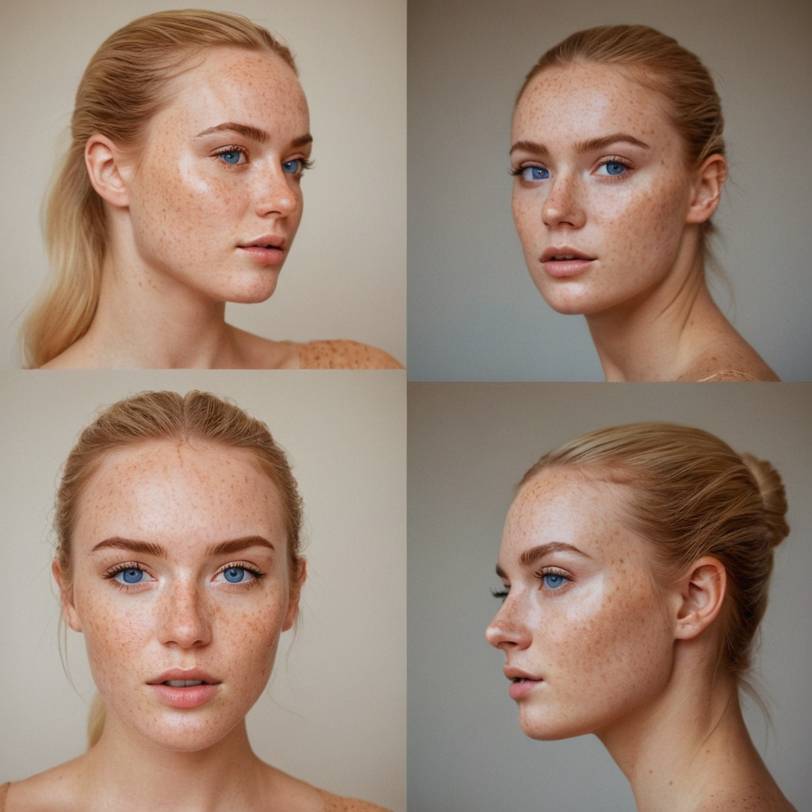
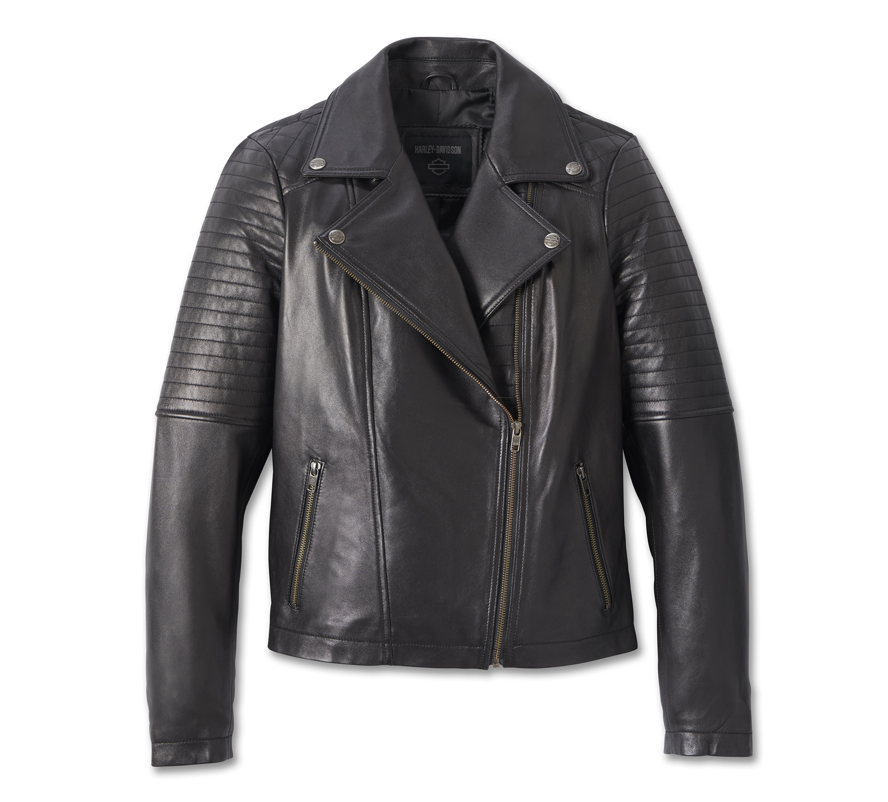
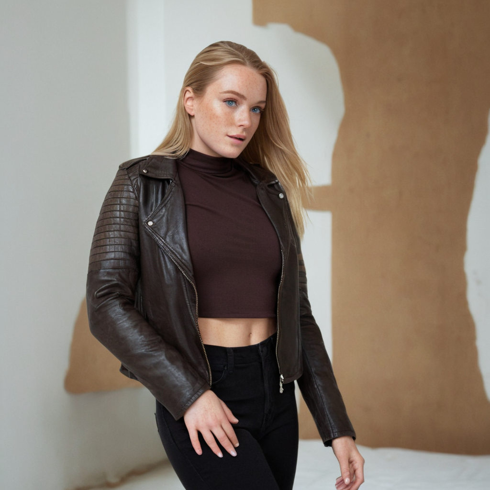
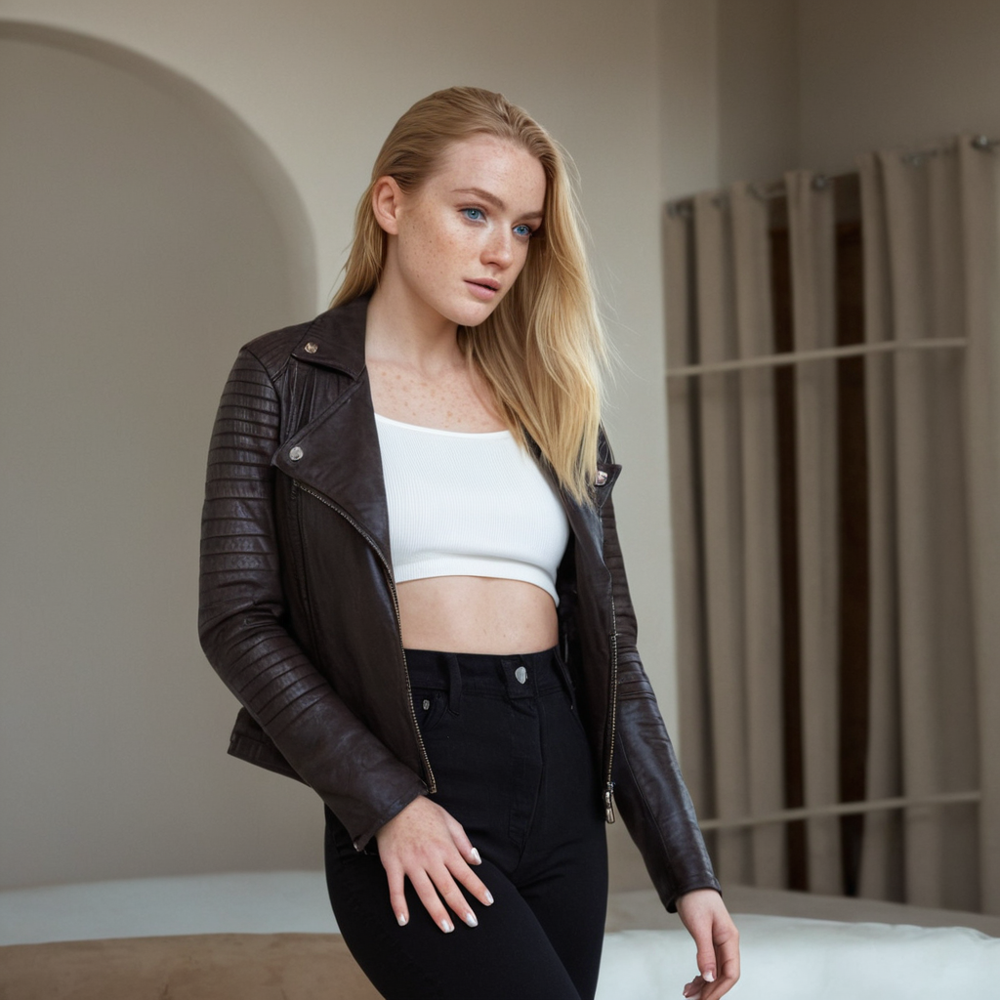
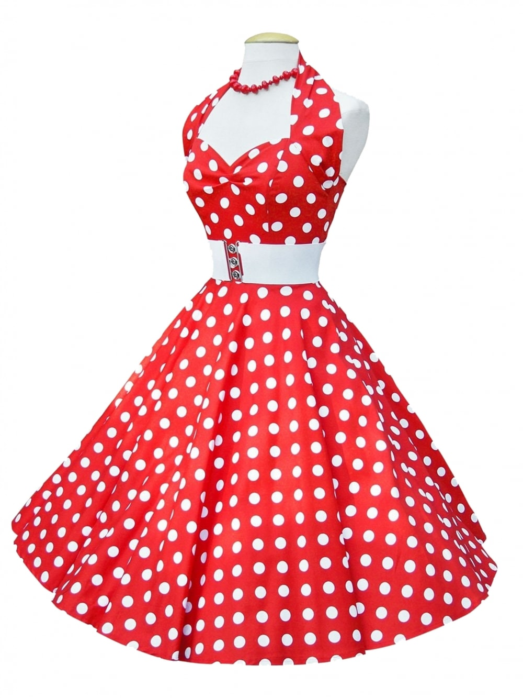

# Character consistency

- use same seed for same character
- use name on prompt, like `cameron mila swift` this is a well known characters, Cameron Diaz, Mila Kunis, Taylor Swift, they are all beautiful, so the model will try to generate a beautiful character, this is only a example name this will be referenced as `{YOUR_CHAR_NAME}`, from now on. 
- Create a `headshot` of the character, with the name of the character
- If we want to change the mood of the character, we can use the prompt we can include it in the prompt, like "`{YOUR_CHAR_NAME}` angry" or "`{YOUR_CHAR_NAME}` big smile" or use `enhance` checkbox and use variation like `vary (Subtle)` or `vary (Strong)` to change the mood of the character.
- Create  3 pictures with the same seed, but with different prompts, like `{YOUR_CHAR_NAME}`, `{YOUR_CHAR_NAME} angry`, `{YOUR_CHAR_NAME} big smile`
- Use the `input image` checkbox to use a image of the character, then take each of the 3 pictures and use the `input image` checkbox. Select advanced and `FaceSwap` for all 3 pictures. This will make the result very consistent with the character.

## Creating character

Positive Prompt: `beautiful woman, soft skin, freckles, arkan blue eyes, cameron mila swift, studio portrait, blond hair`\
Negative Prompt: `bad eyes, cgi, airbrushed, plastic, deformed, watermark`\
seed: `644515184151156`

Then we got the some an chose one.
Then we used the same seed and prompt, only adding `, angry` to the prompt, and got the second image.
Then we used the same seed and prompt, only adding `, big smile` to the prompt, and got the third image.
Try to take pictures with the little diferent tilts.
you can use `input image` checkbox, in tab `upscale and variation`, select the image generated before and chose `Vary (strong)` (not used for the images below).

| Original                                         | Angry                                        | Big Smile                                            |
| ------------------------------------------------ | -------------------------------------------- | ---------------------------------------------------- |
|  |  |  |

With this 3 images we can create a consistent character, with different moods.

### usage sample

Positive Prompt: `beautiful woman, on the beach, in a red dress, soft skin, freckles, arkan blue eyes, cameron mila swift, blond hair`
Negative Prompt: `bad eyes, cgi, airbrushed, plastic, deformed, watermark`
seed: `644515184151156`

Using the`input image` checkbox, in tab `image prompt` select the 3 images generated before and chose `FaceSwap` for all 3 images, with the default settings.
Here is the result:\

### Using Inpating and FaceSwap at same time

I have a image that I liked and I want to use it as a base for the character, but I want to change the character face to be more consistent with the character I created before.\

First I will use the `input image` checkbox, in tab `Inpaint or Outpaint` select the image I want to use as base, and chose `Inpaint` for the image, with the default settings.

Then I will use the `input image` checkbox, in tab `image prompt` select the 1 or more images generated before and chose `FaceSwap`.

then check the `advanced` checkbox and select the `developer debug mode` checkbox,  and the select the `control` tab. check `Mixing Image Prompt and Inpaint` checkbox.

Then click on `Generate` and the model will use the image inpainted and the face swapped image to
then generate the image.\

**upscaling images in my pc is buggy, Vram 8GB, RTX 4060, notebook.**

### FaceSwap with different angles (more precise)

Now lets generate some grid images as pose to our character.

Positive Prompt  `grid of a human head, androgynous, left side view, bald`\
Negative Prompt: `hair, grid lines, color, clothes, accessories`\
In the `advanced` checkbox, select `Style` tab, unselect all and select only `SAI Line art`, set the seed to `random` at `settings` tab, and click on `Generate`.
Generate for both sides, left and right at lest.

#### First approach
With this approach we will generate a single grid image of 4 images, with the same character face, but with different tilts.

now in photopea or another image editor, create a single image with 4 images, 1 with front grid, 1 with left grid, 1 with right grid, and 1 with back grid(if you can).

Something like this:

Then use the `input image` checkbox, in tab `image prompt` select the image generated before and chose `PyraCanny` for all 4 images, with the default settings.
and lets use a similar prompt to the one we used before, but with the grid images (`just added a grid of 4 images`).

Positive Prompt: `a grid of 4 images, beautiful woman, soft skin, freckles, arkan blue eyes, cameron mila swift, studio portrait, blond hair`\
Negative Prompt: `bad eyes, cgi, airbrushed, plastic, deformed, watermark`\
seed: `644515184151156`

then this is one of the results:
 

split the image in 4 and you will have a grid of 4 images with the same character, but with different poses.
| Right                                  | Left angled                                  | Front                                  | left                                  |
| -------------------------------------- | -------------------------------------------- | -------------------------------------- | ------------------------------------- |
|  |  |  |  |

Finally, you can use the the splited images to create a new image of the caracter with a different pose, using the `input image` checkbox, in tab `image prompt` select the 3 images (front, left and right) generated before and chose `FaceSwap` for all 3 images.

here is the final prompt:

Positive Prompt: `beautiful woman, soft skin, freckles, arkan blue eyes, cameron mila swift,  loose blond hair, hyperdetailed photography, soft light, in the club wit a red dress`\
Negative Prompt: `bad eyes, cgi, airbrushed, plastic, deformed, watermark`\
seed: `644515184151156`

and here is the final result:
|                                                       |                                                             |
| ----------------------------------------------------- | ----------------------------------------------------------- |
|  |  |

### Second approach
With this approach we will generate a each face with a different tilt with `FaceSwap` of our first generated character image:

then create more 2 images with the same seed, same prompt but adding the grid image in the `input image` checkbox, in tab `image prompt` select the the grid image generated before and chose `PyraCanny` and then `FaceSwap` for the fist image.

in the end you will have 3 images with the same character, but with different tilts.
| Left                                       | Right                                        | Original                                            |
| ------------------------------------------ | -------------------------------------------- | --------------------------------------------------- |
|  |  |  |

then use the `input image` checkbox, in tab `image prompt` select the 3 images generated before and chose `FaceSwap` for all 3 images.

then this is one of the results:

Positive Prompt: `beautiful woman, soft skin, freckles, arkan blue eyes, cameron mila swift, loose blond hair, hyperdetailed photography, soft light, in the club, wearing a red dress`\
Negative Prompt: `bad eyes, cgi, airbrushed, plastic, deformed, watermark`\
seed: `644515184151156`

|                                                   |                                                   |
| ------------------------------------------------- | ------------------------------------------------- |
|  |  |

### Poses

[Anatomy reference](https://anatomy360.info/anatomy-scan-reference-dump/)\
plaste on console: `$('.onp-sl-overlap-locker-box')[0].style.display='none'; $('.onp-sl-overlap-background').remove(); $('.onp-sl-blur-area')[0].style.filter = 'none'` (remove modal and blur, dev console)

[PoseMyArt](https://posemyart.com/)

Here are a extremely dificult pose to generate with stable diffusion, but with the `PyraCanny` and `CPDSA` we can generate a good results based on a existing image.

Using `PyraCanny`at stopAt: 0.7 and weight: 1 and `CPDSA` at stopAt: 0.4 and weight 1 we can generate similar results, but for me it was not possible to generate good pose with sample of male body and prompt for female body but it was near.

| Result 1                                         | Result 2                                         |
| ------------------------------------------------ | ------------------------------------------------ |
|  |  |

### Clothing
Now lets generate some images with different clothing, but with the same character we created before.

Positive Prompt: `a beautiful woman, soft skin, freckles,  arkan blue eyes, cameron mila swift, blond hair, wearing a jacket, modeling with a jacket, on a empty room, white background`\
Negative Prompt: `bad eyes, cgi, airbrushed, plastic, deformed, watermark`\
seed: `644515184151156`\
aspect ration: `1:1`

| Imput Image StopAt:0,9 Weight: 1          | pyracanny stopAt:0,5, Weigth:1             | FaceSwap stopAt:0,9, Weigth:0,8           | FaceSwap stopAt:0,9, Weigth:0,8           |
| ----------------------------------------- | ------------------------------------------ | ----------------------------------------- | ----------------------------------------- |
|  |  |  |  |

Result:
| Result 1                                   | Result 2                                   |
| ------------------------------------------ | ------------------------------------------ |
|  |  |

#### Change cloth from a image

Let`s create our character with a jacket, and then change the jacket after.

Positive Prompt: `full body view of a beautiful woman, soft skin, freckles, arkan blue eyes, cameron mila swift, blond hair, wearing a jacket, jeans pants and black boots, modeling with a jacket, white background`\
Negative Prompt: `bad eyes, cgi, airbrushed, plastic, deformed, watermark`\
seed: `644515184151156`\
aspect ration: `1:2` (for full body view)
using `FaceSwap` for consistency.

| Jacket (input Image, stopAt:0,8, weigth:0,8) | Left (faceSwap stopAt and Weigth: default) | Right (faceSwap stopAt and Weigth: default)  | center (faceSwap stopAt and Weigth: default)        |
| -------------------------------------------- | ------------------------------------------ | -------------------------------------------- | --------------------------------------------------- |
|          |  |  |  |

Now with the generated images, lets change the jacket.
to the same jacket in the last sample.

| Original                                         | Result                                       |
| ------------------------------------------------ | -------------------------------------------- |
|  |  |

#### Exact clothing change (Masking)

You can use Inpaint mask to wear a character with a exact clothing, like a jacket, a dress, a shirt, etc.

Positive Prompt: `full body view of a beautiful woman, soft skin, freckles, arkan blue eyes, cameron mila swift, blond hair, wearing a dress, neckline, white background`\
Negative Prompt: `bad eyes, cgi, airbrushed, plastic, deformed, watermark`\
seed: `644515184151156`

For the image prompts we will still use the same 3 `FaceSwap` images that we used before.
in the inpaint tab, select we ***selected the cloth that we want to use as mask**, and then we selected the the `Enable advanced masking feature` checkbox, in the method I used `Modify content` with better results, then at the right select the `SAM (Segment anythings model)` Mask generation model, click on the `Generate mask from image` button,
then above the selected SAM model, check `Invert mask when generating`, this will generate outside de mask, leting us to make someone wear the dress.
With all this set, click on `Generate`.

***The aspect ratio of the inpaint image and the result should be same or next to the same, an cleaner as possible to avoid distortion**

| Original image                        | Inpaint input to mask edited before use(1:2) | Result                               |
| ------------------------------------- | -------------------------------------------- | ------------------------------------ |
|  |         |  |

You can use **Mask erode or dilate** at the Advanced checkbox and inpaint tab to make the mask more precise, or use the inpaint mask to make the mask more precise.

So that is it. Here is one sample of the previous character holding a flask of perfume.

As you can see, we maintained the character hand and the flask, but changed evething else.

### Creating a character withe especific hair style

You can get an especific hair style from another image and apply to your character

First, make sure the output forma is the same as the reference, in this case `1024x1024`.

Get the reference and apply `Image prompt` to the image, we used about `0,9` at `stop At` and `0,9` at `weight`
In the `Advanced` checkbox, select the `Developer debug mode` and then the `Control` tab, check the `Mixing Image Prompt and Inpaint` checkbox.
Then in the `Inpaint or Outpaint` tab, select the the area that you want, here we selected the hair and at the `Method`, `Modify Content` with additional prompt of `sort hair` but the default `Inpaint or Outpaint` gave same result.
Now click on `Generate`.

| Reference Image                       | Original Image                                | Result                                     |
| ------------------------------------- | --------------------------------------------- | ------------------------------------------ |
|  |  |  |
