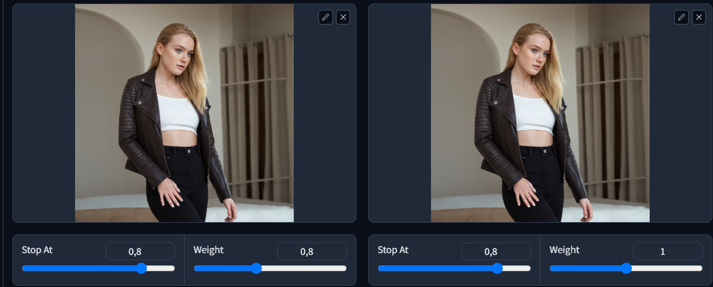
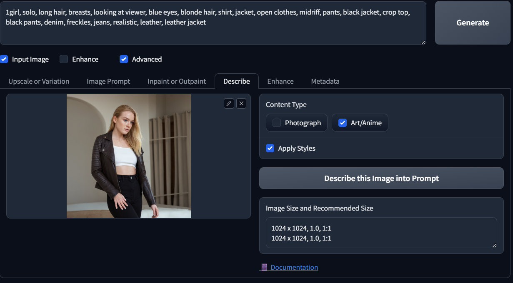
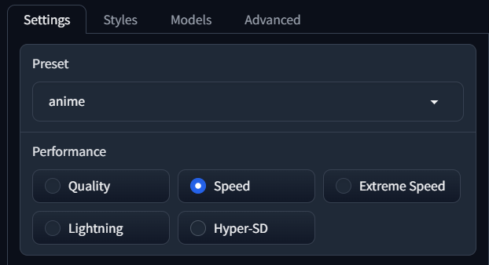
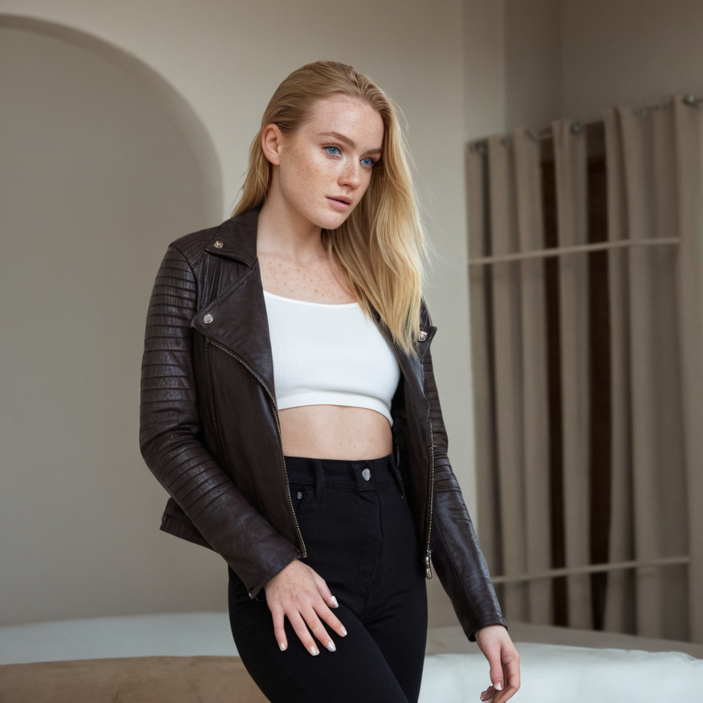
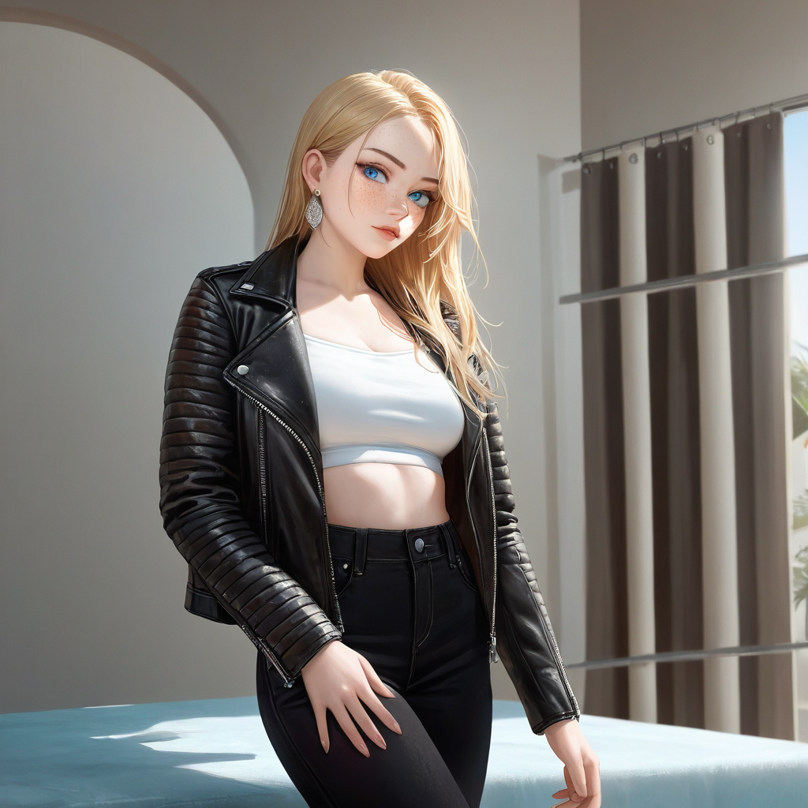
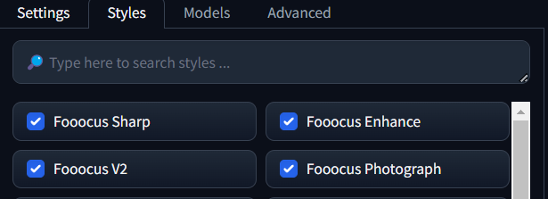
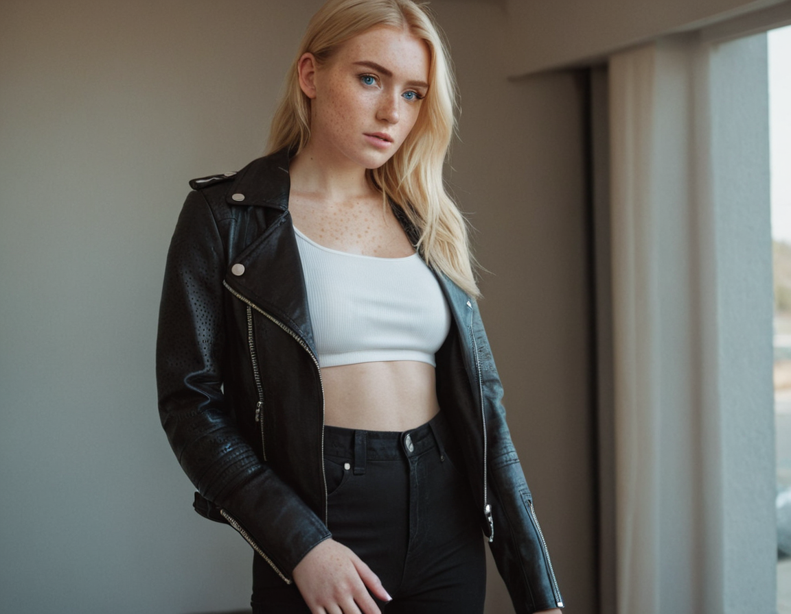

# Picture to anime and anime to picture

## Picture to anime

Firt you need to upload the image that you want to convert to anime into the `Input Image` section, at the `Input Image` checkbox.
place the image with `image prompt` and if you want to matain the pose of the image, you can add another image prompt with the same image as `PyraCanny` method.

After that you can change to `Describe` tab and add the same image to the `image prompt`, select the `content type` as `art/anime`
and click on the `Generate prompt` button.

in the advanced checkbox you can change the `Preset` to `Anime` and then click on the `Generate` button.

| Original (input image)                                         | Result anime                                                  |
| -------------------------------------------------------------- | ------------------------------------------------------------- |
|  |  |

## Anime to picture

The process is the same as the `Picture to anime` but you need to add some extra prompt to the positive prompt cause the description generated by the `Describe` tab is too simple when getting from a anime image. Then change the `Preset` to `initial` in the advanced checkbox, also include in the style tab `Fooocus Photograph`.

this is a sample of generate description from a anime image : `there is a young woman posing for the camera`\
and this is a better prompt to generate a image from a anime image: `photo of a young woman, arkan blue eyes, blond hair, freckles, wearing a black leather jackect and a white cropped, posing for the camera`

| Anime (input image)                                           | Result photo                                                  |
| ------------------------------------------------------------- | ------------------------------------------------------------- |
|  |  |
