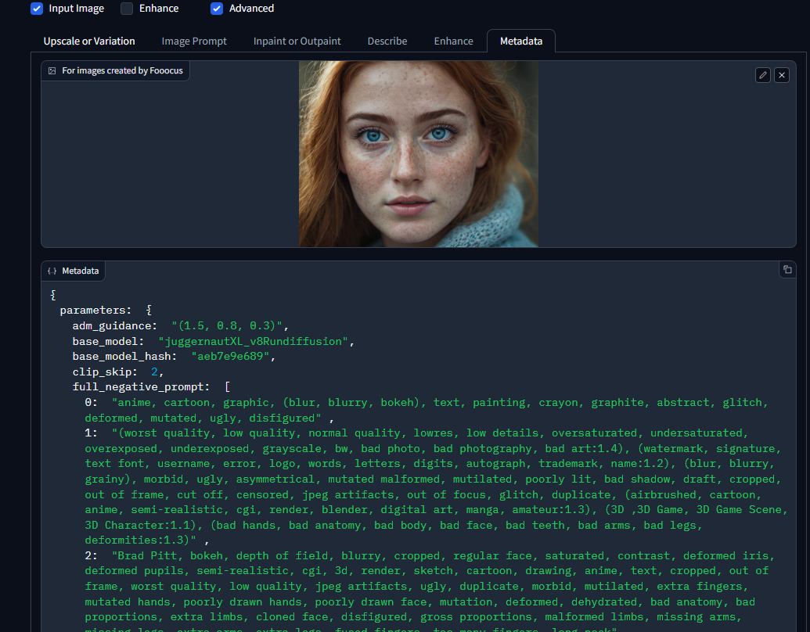

# Recreate image with metadata
First of all, you need to know that you need to explicit tell the Fooocus to generate images with metadata on it. To do this you musto go to the `Advanced` checkbox and check `Developer debug mode`, then you scroll down to check `Save metadata to images`. After that you can generate images with metadata on it.\

Once you generate the image with metadata, you can use the metadata to recreate the image. To do this you need to the `Input image` checkbox, in the `Metadata` tab drag and drop the image with metadata or select the image by clicking on the field to drag and drop the image. Then you will see below the loaded image, the metadata that you can use to recreate the image. 
Just click on `Apply metadata` and then click on `Generate` to recreate the image.

