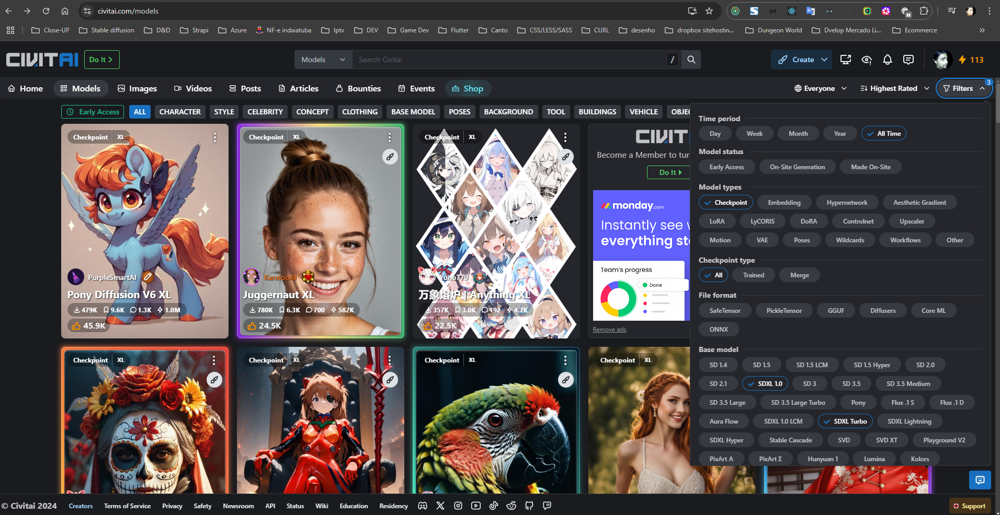
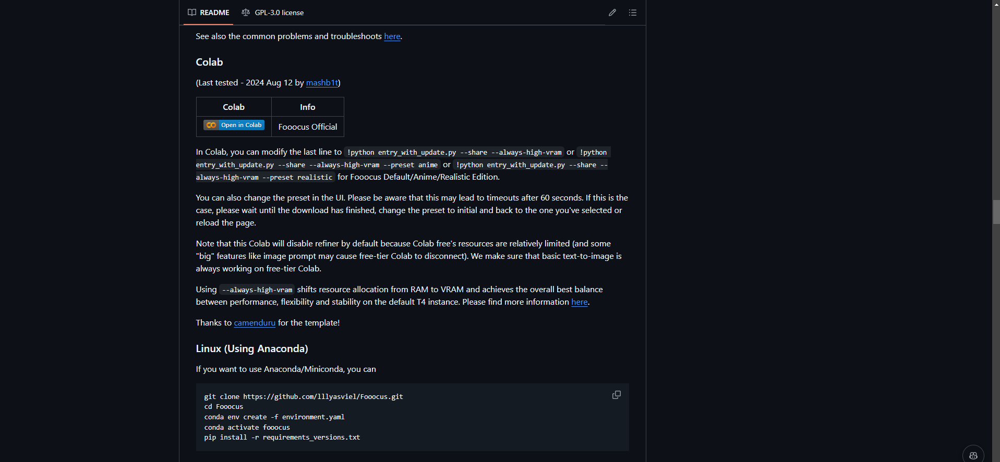
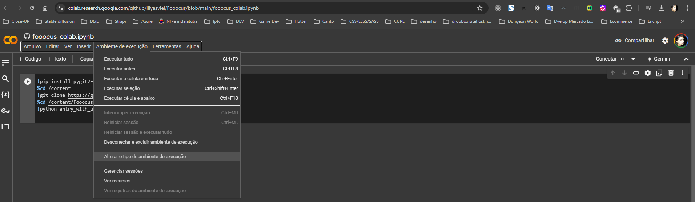
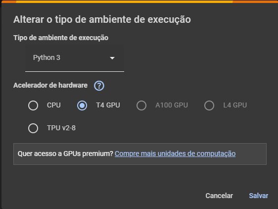
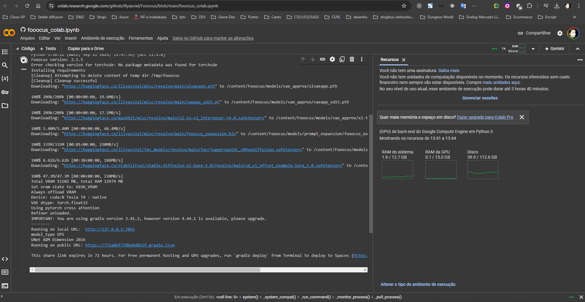
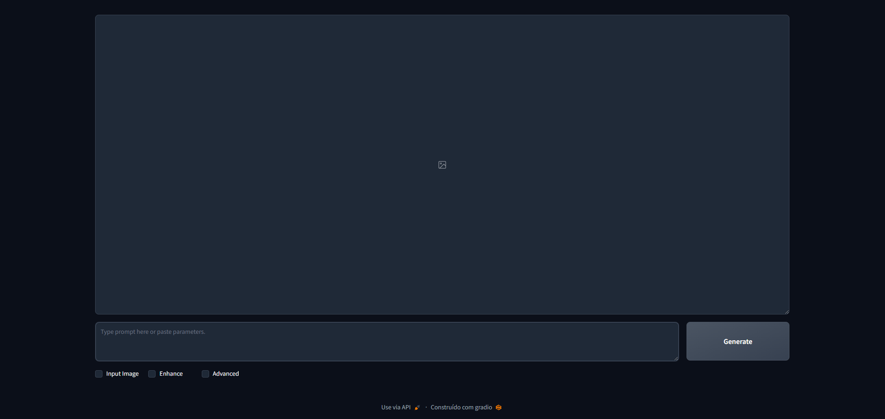

# Fooocus UI
Fooocus is a interface that you can use to generate images with Stable Diffusion. It is a very simple and easy to use interface that you can use to generate images with Stable Diffusion.

Summary:
- [Fooocus UI](#fooocus-ui)
	- [How to use Fooocus](#how-to-use-fooocus)
		- [Locally](#locally)
			- [Instal different checkpoints and LoRAs](#instal-different-checkpoints-and-loras)
		- [Cloud (Google Colab)](#cloud-google-colab)
			- [Instal different checkpoints and LoRAs](#instal-different-checkpoints-and-loras-1)
	- [The interface](#the-interface)
		- [Advanced settings checkbox](#advanced-settings-checkbox)
		- [Enhanced settings checkbox](#enhanced-settings-checkbox)
		- [Input Image settings checkbox](#input-image-settings-checkbox)
	- [Extra](#extra)
		- [Consistent Characters](#consistent-characters)
		- [Juggernaut XL Prompt Guide](#juggernaut-xl-prompt-guide)

## How to use Fooocus
There ar 2 ways to use Fooocus:
* Locally
* In the cloud

[GitHub](https://github.com/lllyasviel/Fooocus)


### Locally
Just follow the instructions in the [Fooocus GitHub repository](https://github.com/lllyasviel/Fooocus)

#### Instal different checkpoints and LoRAs
Fooocus use XL models, older not XL models may not work, but you can use different checkpoints and LoRAs from [CivitAI](https://civitai.com/models). To do this, you need to download the checkpoints and LoRAs from CivitAI and put them in the `models/checkpoints` and `models/loras` folders. Then you can use the interface to generate images with the checkpoints and LoRAs that you downloaded.
To improve the performance of the interface, can check for XL Turbo models, that are faster than the XL models.



**NOTE:After donwload a new Checkpoint or LoRA, check the samples and configurations in the model page to use it in the interface.**

### Cloud (Google Colab)
Go to the github repository and click on the [`Open in Colab`](https://colab.research.google.com/github/lllyasviel/Fooocus/blob/main/fooocus_colab.ipynb) button. Then you can use the interface in the cloud.



Before you start using Fooocus in the colab notebook, go to the `Runtime` menu and click on `Change runtime type`. Then select `GPU` in the `Hardware accelerator` dropdown.




Then click on save and you are ready to use Fooocus in the cloud.
run the first cell to install the dependencies and then run the second cell to start the interface.



You may want to se this [Using checkpoints and LoRAs from CivitAI.](./using_checkpoints_loras_from_cvitia.md) to use checkpoints and LoRAs from CivitAI.

#### Instal different checkpoints and LoRAs

```python
!pip install pygit2==1.15.1
%cd /content
!git clone https://github.com/lllyasviel/Fooocus.git
%cd /content/Fooocus
```
```python
!wget -O /content/Fooocus/models/checkpoints/{CHECKPOINT_NAME}.safetensors {CHECKPOINT_URL}
```
```python
!wget -Lo /content/Fooocus/models/loras/{LORA_NAME}.safetensors {LORA_URL}
```
```python
!python entry_with_update.py --share --always-high-vram
```

DreamShaper XL (Checkpoint)(goes in second line): `!wget -O /content/Fooocus/models/checkpoints/DreamShaper-XL.safetensors https://civitai.com/api/download/models/351306?type=Model&format=SafeTensor&size=full&fp=fp16`

Detail Tweaker XL (LoRA)(goes in third line): `!wget -Lo /content/Fooocus/models/loras/DetailTweaker-XL.safetensors https://civitai.com/api/download/models/135867?type=Model&format=SafeTensor`

so as you can see `!wget -O` is for getting the checkpoint and `!wget -Lo` is for getting the LoRA.
In colab you well need to run each line.\
[open in colab](https://colab.research.google.com/github/Apostata/Apostata/blob/main/fooocus_colab.ipynb)

## The interface
The interface is very simple and easy to use. here is the initial view.



There ar 3 checkboxes that you can use to change the settings of the image generation process.
* Advanced: If you want to use advanced settings, check this box.
* Input Image: If you want to use an input image, check this box and upload the image.
* Enhance: If you want to enhance the image, check this box.
  
**You can enable more than one checkbox at the same time.**

### Advanced settings checkbox

The advanced settings checkbox is where you can change things like the performance, aspect ratio, image number, output format, negative prompt, random seed, history log, guidance scale, image sharpness, inpaint respective field, and documentation.\
[GO TO Advanced settings checkbox content](./Fooocus_ui_advanced_checkbox.md)

### Enhanced settings checkbox

The enhanced settings checkbox is where you can change things like the upscaling, order of processing, detection prompt, enhancement positive prompt, detection, inpaint, inpaint engine, inpaint denoising strength.\
[GO TO Enhanced settings checkbox content](./Fooocus_ui_enhanced_checkbox.md)

### Input Image settings checkbox

The input image settings checkbox is where you can change things like the inpaint method, inpaint prompt, original prompt, inpaint respective field, and details method. Ever with a selected image, you can change the prompt and inpaint method to generate a new image.\
[GO TO Input Image settings checkbox content](./Foocus_ui_input_image_checkbox.md)


## Extra

### Consistent Characters
If you want to generate images with consistent characters, in the [Multiple controlnets](./Foocus_ui_input_image_checkbox.md#multiple-methods) section there is a sample use case of how to generate images with consistent characters, using `FaceSwap` and `PyraCanny` methods. One litte aditional thing is that you use the same `seed` instead of the random seed to generate the images with the same characters (this configuration is found at the [Random seed](./Fooocus_ui_advanced_checkbox.md#random-seed)).

### Juggernaut XL Prompt Guide
As de default checkpoint of `Fooocus` is Juggernaut XL, here is a link to guide a good prompt for this model: [Juggernaut XL Prompt Guide](https://learn.rundiffusion.com/prompt-guide-for-juggernaut-xi-and-xii/)

[BACK to Stable Diffusion models](./stable_difusion.md)\
[BACK TO BEGIN](./README.MD)