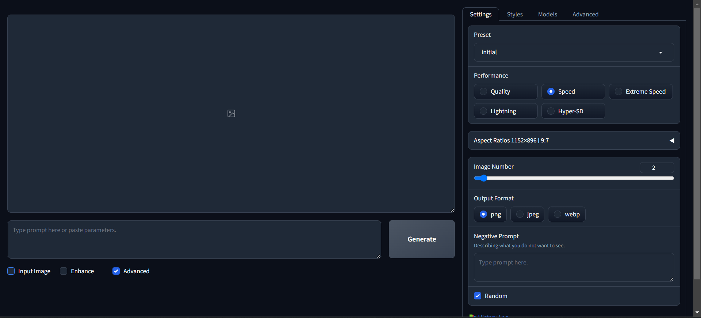
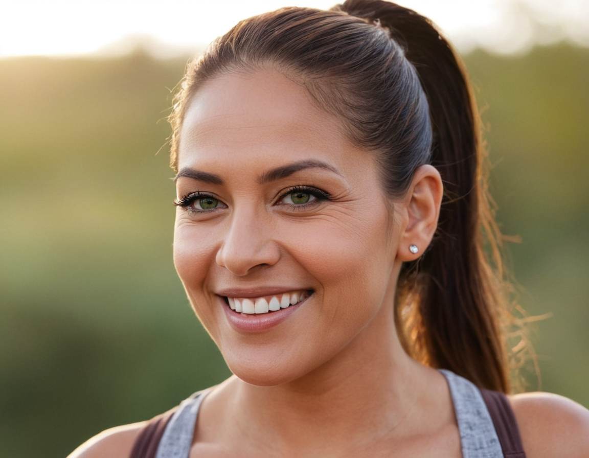

# Fooocus UI
Fooocus is a interface that you can use to generate images with Stable Diffusion. It is a very simple and easy to use interface that you can use to generate images with Stable Diffusion.

## How to use Fooocus
There ar 2 ways to use Fooocus:
* Locally
* In the cloud

[GitHub](https://github.com/lllyasviel/Fooocus)

### Locally
Just follow the instructions in the [Fooocus GitHub repository](https://github.com/lllyasviel/Fooocus)

### Cloud (Google Colab)
Go to the github repository and click on the [`Open in Colab`](https://colab.research.google.com/github/lllyasviel/Fooocus/blob/main/fooocus_colab.ipynb) button. Then you can use the interface in the cloud.

Before you start using Fooocus in the colab notebook, go to the `Runtime` menu and click on `Change runtime type`. Then select `GPU` in the `Hardware accelerator` dropdown.

Then click on save and you are ready to use Fooocus in the cloud.
run the first cell to install the dependencies and then run the second cell to start the interface.

You may want to se this [Using checkpoints and LoRAs from CivitAI.](./using_checkpoints_loras_from_cvitia.md) to use checkpoints and LoRAs from CivitAI.

## The interface
The interface is very simple and easy to use. here is the initial view.

There ar 3 checkboxes that you can use to change the settings of the image generation process.
* Advanced: If you want to use advanced settings, check this box.
* Input Image: If you want to use an input image, check this box and upload the image.
* Enhance: If you want to enhance the image, check this box.
  
**You can enable more than one checkbox at the same time.**

### Advanced settings

#### Settings Tab
##### Pressets
The presset is a simpler way to change the model that will be used to generate the image. You can select the presset that you want to use in the dropdown.

##### Performance
You can change the performance settings to make the image generation faster or slower. You can select the performance that you want to use in the radio buttons.
Faster the image generation, lower is the number of steps and the quality of the image.

##### Aspect Ratio
You can change the aspect ratio of the image. You can select the aspect ratio that you want to use in the radio buttons.

##### Image Number
You can change the number of images that will be generated. You can select the number of images that you want to generate in the slide button.

##### Output Format
You can change the output format of the image. You can select the output format that you want to use in the radio buttons.
There are 3 options:
* PNG - Portable Network Graphics - recommended
* JPEG - Joint Photographic Experts Group
* WEBP - WebP image format

##### Negative Prompt
You can type a negative prompt to generate the image. You can type the negative prompt that you want to use in the text box.

##### Random Seed
You can change the random seed of the image. You can unchek the random and type the seed that you want to use in the text box.

##### History log
You can see the history log of the image generation process. You can see the history log by clicking on the button.
The history log is a list of the images that were generated with the settings that were used.

#### Styles Tab
The styles tab is where you can change the styles of the image. You can change the styles of the image by clicking on the buttons.
also you can improve the prompt with the `Fooocus V2`, `Fooocus Enhance`, `Fooocus Sharp` styles, that already are checked by default with the `Initial` Presset.
All styles show a image preview of the style if you hover the mouse over the button.

#### Models Tab
The models tab is where you can change the models that will be used to generate the image. You can change the models by clicking on the Dropdown model button.
You also can use LoRAs, that are a way to use a model that was trained with a specific prompt. You can use LoRAs by clicking on the Dropdown LoRA button, selecting the LoRA that you want to use and at the right you will have the `Weight` slider to change the weight of the LoRA.

#### Advanced Tab
##### Guidance Scale
Is how much the IA will follow the prompt. You can change the guidance scale by clicking on the slide button.
Best values are between 3 and 7
##### Image Sharpness

##### Documentation
You can see the documentation of the image generation process. You can see the documentation by clicking on the button.
Here is the direct link to the [documentation](https://github.com/lllyasviel/Fooocus/discussions/117)

##### Developer Debug Mode
Advanced settings for developers. You can see the developer debug mode by clicking on the button.

### Enhance settings

#### Upscale or Variation
##### Upscale or Variation
You can change the upscale or variation of the image. You can select the upscale or variation that you want to use in the radio buttons.

###### Variations
You can generate images with variations of the prompt. This is useful when you want to generate images with slight or significant changes in the prompt.

* Vary (subtle) - The AI will generate images with subtle variations of the prompt. This is useful when you want to generate images with slight changes in the prompt.
* Vary (strong) - The AI will generate images with strong variations of the prompt. This is useful when you want to generate images with significant changes in the prompt.

Let's generate a image with to see the difference between the variations. 

prompt : `photograph close up portrait of a female boxer training, serious, stoic cinematic 4k epic detailed photograph shot on kodak detailed cinematic bokeh cinematic hbo dark moody`
negative prompt: `bad eyes, cgi, airbrused, platic, deformed, watermark`

now let`s upload the original image to the upscale or variation tab and generate the images with some variations.

| original                                     | variation Subtle                                   | variation strong                                   |
| -------------------------------------------- | -------------------------------------------------- | -------------------------------------------------- |
|  |  |  |

changing the prompt
Still using the original image, let's change the prompt to see the difference between the variations.

new prompt: `smile`

| original                                     | variation Subtle                                   | variation strong                                    |
| -------------------------------------------- | -------------------------------------------------- | --------------------------------------------------- |
|  |  |  |

With this drastic change in the prompt, the variations are more noticeable, and the image generated starts to lose the original concept and differs from the previous image generated.

now let's change the prompt again to just include the word `smile` in the original prompt.

new prompt: `photograph close up portrait of a female boxer training, with a smile, stoic cinematic 4k epic detailed photograph shot on kodak detailed cinematic bokeh cinematic hbo dark moody`

| original                                     | variation Subtle                                           | variation strong                                           |
| -------------------------------------------- | ---------------------------------------------------------- | ---------------------------------------------------------- |
|  |  |  |

With this change in the prompt, the variations are more noticeable, and the image generated is now more consistent with the original concept and the previous image generated.

###### Upscaling images

You can upscale the image. This is useful when you want to generate images with a higher resolution than the original image.

in Fooocus you can upscale the image in 3 ways:
* 1.5x - The AI will generate images with 1.5 times the resolution of the original image, in Foocus the image will change a little bit.
* 2x - The AI will generate images with 2 times the resolution of the original image, in Foocus the image will change a little bit(more than 1.5x).
* Fast 2x - The AI will generate images with 2 times the resolution of the original image, but **mataining more of the original image**.

Let's generate a image with to see the difference between the upscaling.

prompt : `beautiful lady, (freckles:0.8), big smile, brown hazel eyes, ponytail, dark makeup, hyperdetailed photography, soft light, medium shot, red shirt, cover, in the city`

negative prompt: `bad eyes, cgi, airbrused, platic, deformed, watermark`

now let`s upload the original image to the upscale or variation tab and generate the images with some upscaling.

| original                                   | 1.5x                              | 2x                            | Fast 2x                                 |
| ------------------------------------------ | --------------------------------- | ----------------------------- | --------------------------------------- |
|  |  |  |  |

As you can see, the image generated with the `Fast 2x` option maintains more of the original image than the other options.

Let's try with **no prompt**, just the original image.

| original                                   | 1.5x                                        | 2x                                      | Fast 2x                                           |
| ------------------------------------------ | ------------------------------------------- | --------------------------------------- | ------------------------------------------------- |
|  |  |  |  |

As you can see, all images except `Fast 2x` have a significant change in the image generated, and the `Fast 2x` option maintains more of the original image.

##### Order of Processing
Use before or after the image generation process. You can select the order of processing that you want to use in the radio buttons.

##### #1, #2, #3 tabs
This tabs are for the advanced settings of the image generation process. 

* Detection prompt - With the detection prompt, you can enhance some parts of the image that you think are not good enough. You can type the detection prompt that you want to use in the text box.
* Enhancement positivr prompt - With the enhancement positive prompt, you can enhance some parts of the image that you think are not good enough. You can type the enhancement positive prompt that you want to use in the text box.

###### Detection
The detection dropdown is where you can select the detection model that will be used to detect the parts of the image that you want to enhance. You can select the detection model that you want to use in the dropdown.

###### Inpaint
The inpaint dropdown is where you can select the inpaint model that will be used to inpaint the parts of the image that you want to enhance. You can select the inpaint model that you want to use in the dropdown.

* Inpaint Engine 
* Inpaint denoising strength - The inpaint denoising strength is how much the inpaint model will denoise the image. More denoise, more changes in the image.
* Inpaint Respective Field - Is the area of that the inpaint model will use to inpaint the image. More area, more in the context of the whole image.

### Input Image settings

#### Upscale or Variation
as in the enhance settings, you can change the upscale or variation of the image. You can select the upscale or variation that you want to use in the radio buttons.

#### Image Prompt
You can upload an image to generate the image. You can upload the image by clicking on the button.

#### Inpaint or Outpaint
You can inpaint or outpaint the image
 let's consider this initial prompt: `a half body photo of a beautiful indigenous lady, 40 yo, in the nature, big smile, brown hazel eyes, ponytail, dark makeup, hyperdetailed photography, soft light` 

let's change the color of the woman's eyes in the image.

* Inpaint - The AI will inpaint the image. This is useful when you want to change, add, or remove some parts or details of the image.

changed prompt: `a half body photo of a beautiful indigenous lady, 40 yo, in the nature, big smile, brigth green eyes, ponytail, dark makeup, hyperdetailed photography, soft light`

| original image                             | inpainted image                        | inpainted image and prompt change                           |
| ------------------------------------------ | -------------------------------------- | ----------------------------------------------------------- |
|  |  |  |

the above image is the result of the inpaint process with the inpaint method seted to `Improve Detail (face, hand, eyes, etc.)`

| inpainted hair                                      | inpainted background                                      |
| --------------------------------------------------- | --------------------------------------------------------- |
|  |  |

the above image is the result of the inpaint process with the inpaint method seted to `Modify Content (add objects, change background, etc.)`

* Outpaint - The AI will outpaint the image. This is useful when you want to change the resolution, making the image bigger or smaller.
  
Original prompt: `beatiful Afro american brazilian woman, long hair, eyeglasses, casual clothing, sitting at desk, wrinting a book, laptop, home office, indoor, nightlight, spot light, focus medium shot`

#### Describe
This will get the prompt from the image. You can get the prompt from the image by uploading the image and clicking on the button.

#### Enhance
Same as the enhance settings, you can enhance the image.
In here, you can drop the image and enhance it.
To do that, drop the image in the `Drop image here` box and also check the `Enhance` checkbox. Then enable at least on of the `#` tabs.

We now add the following prompt to the image `Enhancement positive prompt` : `perfect blue eyes`.
Now we will compare the original image with the enhanced image and with another enhanced image with the inpaint method seted to `Improve Detail (face, hand, eyes, etc.)`

let's see an example of an image enhancement.

in this sample we will use the `Enhance` checkbox and the `#1` tab. and enhance and change the eyes of the boxer in the image.

| original image                             | enhanced image                             | enhanced image with the impaint method            |
| ------------------------------------------ | ------------------------------------------ | ------------------------------------------------- |
|  |  |  |

#### Metadata
Get the metadata from the image. You can get the metadata from the image by uploading the image and clicking on the button.
Metadata is the data that describes the image, for example, the size of the image, the format of the image, the date that the image was created, the model used to generate this image, etc.

## Extra
As de default checkpoint of `Fooocus` is Juggernaut XL, here is a link to guide a good prompt for this model: [Juggernaut XL Prompt Guide](https://learn.rundiffusion.com/prompt-guide-for-juggernaut-xi-and-xii/)

[BACK to Stable Diffusion models](./stable_difusion.md)\
[BACK TO BEGIN](./README.MD)