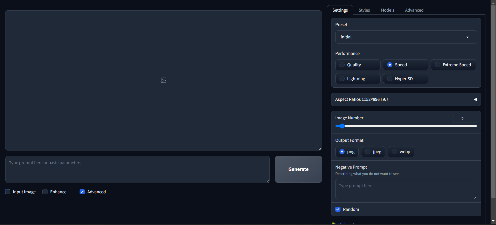

# Advanced settings

## Settings Tab
### Pressets
The presset is a simpler way to change the model that will be used to generate the image. You can select the presset that you want to use in the dropdown.

### Performance
You can change the performance settings to make the image generation faster or slower. You can select the performance that you want to use in the radio buttons.
Faster the image generation, lower is the number of steps and the quality of the image.

### Aspect Ratio
You can change the aspect ratio of the image. You can select the aspect ratio that you want to use in the radio buttons.

### Image Number
You can change the number of images that will be generated. You can select the number of images that you want to generate in the slide button.

### Output Format
You can change the output format of the image. You can select the output format that you want to use in the radio buttons.
There are 3 options:
* PNG - Portable Network Graphics - recommended
* JPEG - Joint Photographic Experts Group
* WEBP - WebP image format

### Negative Prompt
You can type a negative prompt to generate the image. You can type the negative prompt that you want to use in the text box.

### Random Seed
You can change the random seed of the image. You can unchek the random and type the seed that you want to use in the text box.

### History log
You can see the history log of the image generation process. You can see the history log by clicking on the button.
The history log is a list of the images that were generated with the settings that were used.

## Styles Tab
The styles tab is where you can change the styles of the image. You can change the styles of the image by clicking on the buttons.
also you can improve the prompt with the `Fooocus V2`, `Fooocus Enhance`, `Fooocus Sharp` styles, that already are checked by default with the `Initial` Presset.
All styles show a image preview of the style if you hover the mouse over the button.

## Models Tab
The models tab is where you can change the models that will be used to generate the image. You can change the models by clicking on the Dropdown model button.
You also can use LoRAs, that are a way to use a model that was trained with a specific prompt. You can use LoRAs by clicking on the Dropdown LoRA button, selecting the LoRA that you want to use and at the right you will have the `Weight` slider to change the weight of the LoRA.

## Advanced Tab
### Guidance Scale
Is how much the IA will follow the prompt. You can change the guidance scale by clicking on the slide button.
Best values are between 3 and 7
### Image Sharpness

### Documentation
You can see the documentation of the image generation process. You can see the documentation by clicking on the button.
Here is the direct link to the [documentation](https://github.com/lllyasviel/Fooocus/discussions/117)

### Developer Debug Mode
Advanced settings for developers. You can see the developer debug mode by clicking on the button.

[BACK to Fooocus Ui](./Fooocus_ui.md)\
[BACK TO BEGIN](./README.MD)