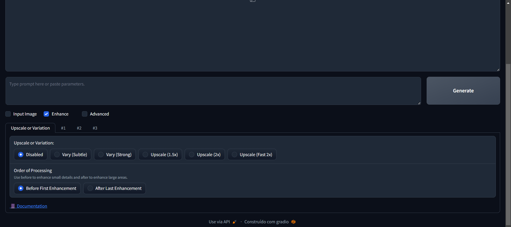
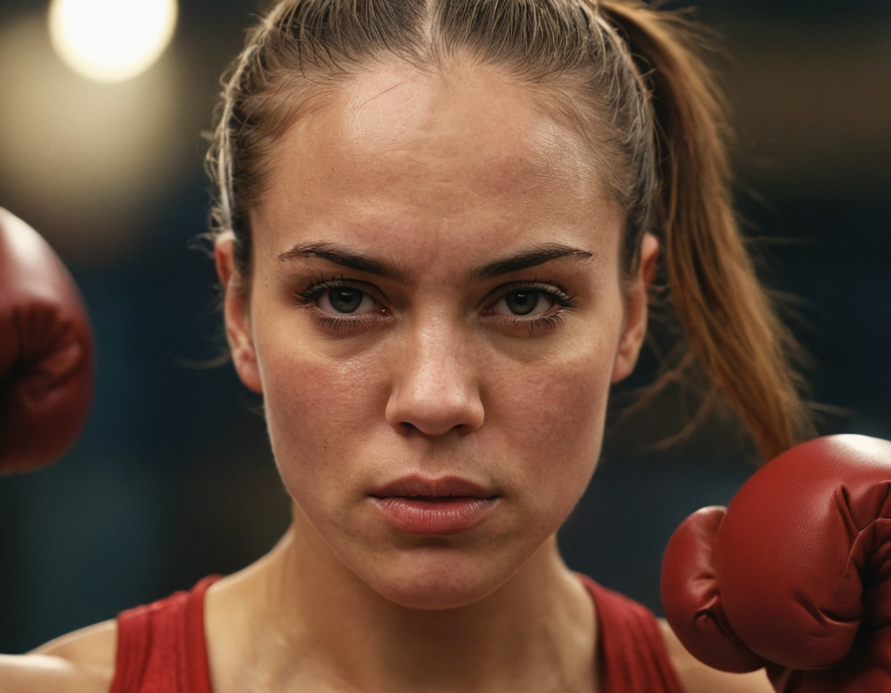
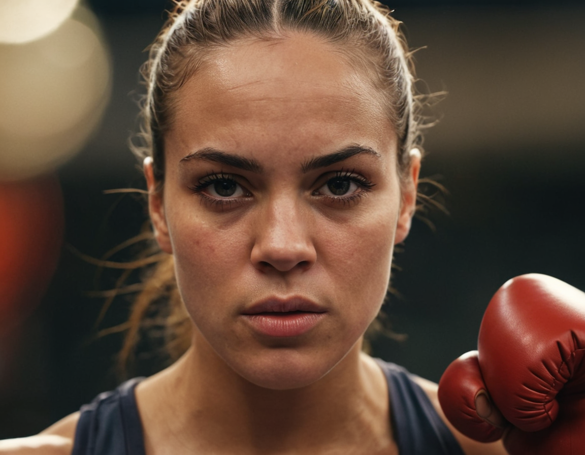
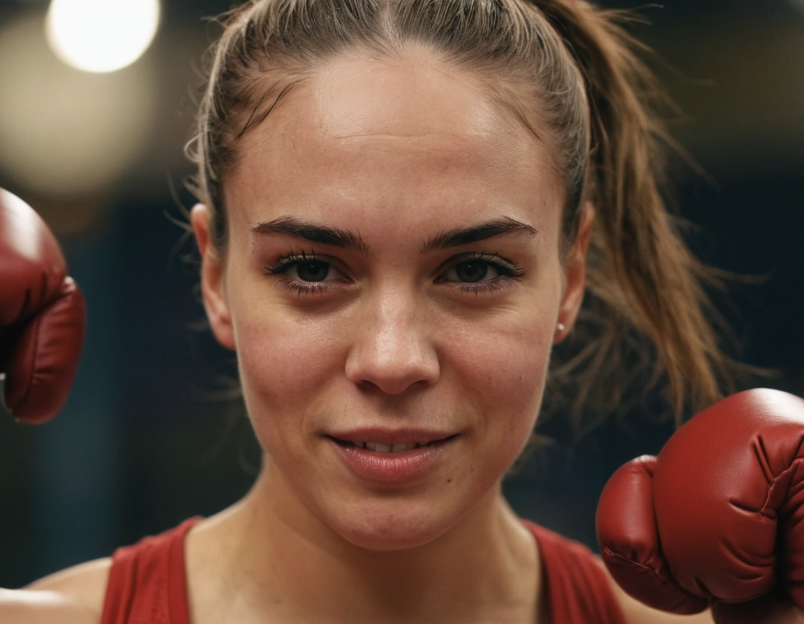
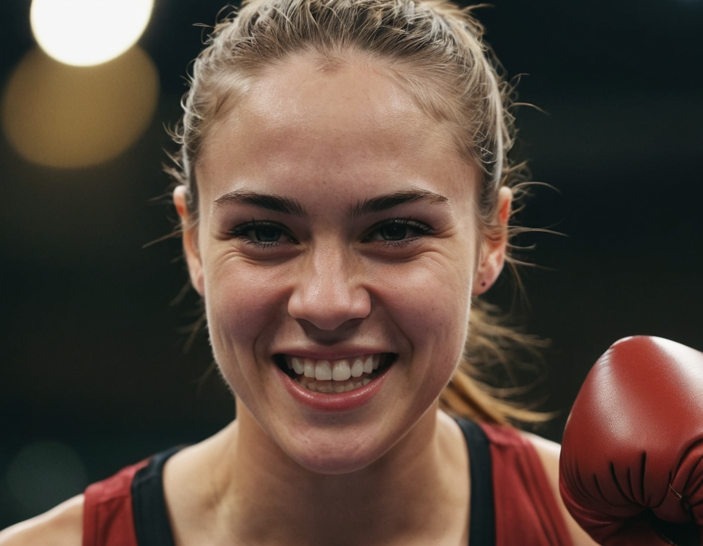
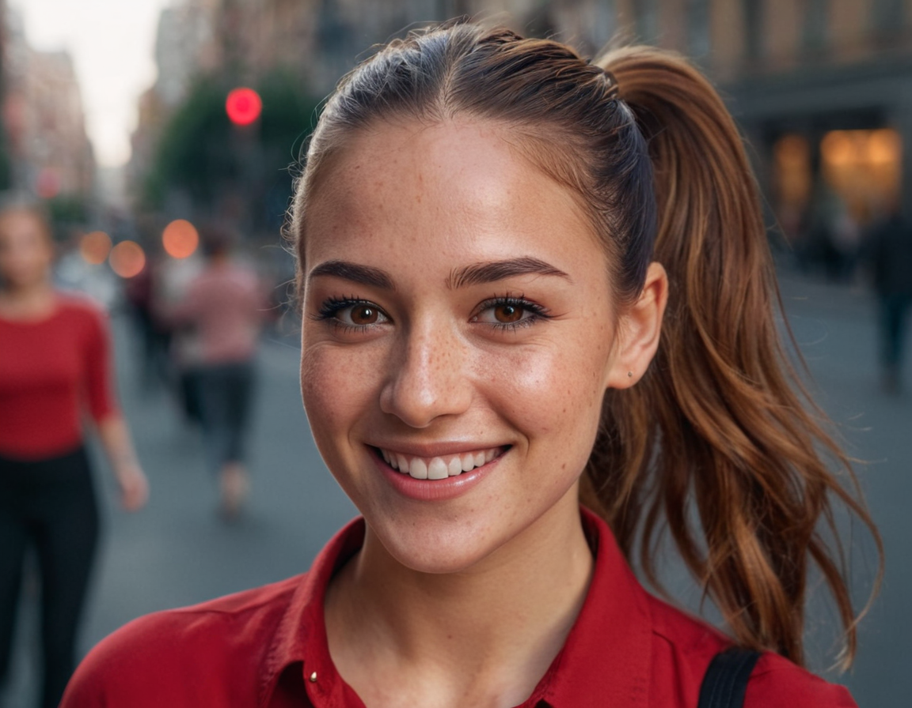
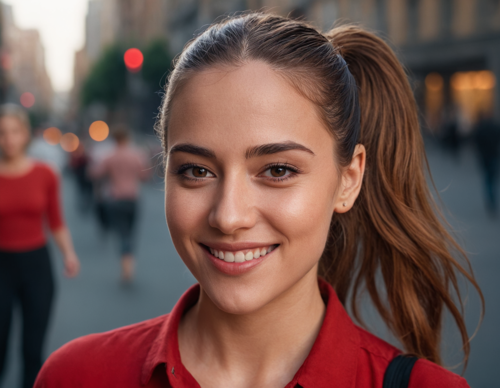

# Enhance settings

## Upscale or Variation
### Upscale or Variation
You can change the upscale or variation of the image. You can select the upscale or variation that you want to use in the radio buttons.

#### Variations
You can generate images with variations of the prompt. This is useful when you want to generate images with slight or significant changes in the prompt.

* Vary (subtle) - The AI will generate images with subtle variations of the prompt. This is useful when you want to generate images with slight changes in the prompt.
* Vary (strong) - The AI will generate images with strong variations of the prompt. This is useful when you want to generate images with significant changes in the prompt.

Let's generate a image with to see the difference between the variations. 

prompt : `photograph close up portrait of a female boxer training, serious, stoic cinematic 4k epic detailed photograph shot on kodak detailed cinematic bokeh cinematic hbo dark moody`
negative prompt: `bad eyes, cgi, airbrused, platic, deformed, watermark`

now let`s upload the original image to the upscale or variation tab and generate the images with some variations.

| original                                     | variation Subtle                                   | variation strong                                   |
| -------------------------------------------- | -------------------------------------------------- | -------------------------------------------------- |
|  |  |  |

changing the prompt
Still using the original image, let's change the prompt to see the difference between the variations.

new prompt: `smile`

| original                                     | variation Subtle                                   | variation strong                                    |
| -------------------------------------------- | -------------------------------------------------- | --------------------------------------------------- |
|  |  |  |

With this drastic change in the prompt, the variations are more noticeable, and the image generated starts to lose the original concept and differs from the previous image generated.

now let's change the prompt again to just include the word `smile` in the original prompt.

new prompt: `photograph close up portrait of a female boxer training, with a smile, stoic cinematic 4k epic detailed photograph shot on kodak detailed cinematic bokeh cinematic hbo dark moody`

| original                                     | variation Subtle                                           | variation strong                                           |
| -------------------------------------------- | ---------------------------------------------------------- | ---------------------------------------------------------- |
|  |  |  |

With this change in the prompt, the variations are more noticeable, and the image generated is now more consistent with the original concept and the previous image generated.

#### Upscaling images

You can upscale the image. This is useful when you want to generate images with a higher resolution than the original image.

in Fooocus you can upscale the image in 3 ways:
* 1.5x - The AI will generate images with 1.5 times the resolution of the original image, in Foocus the image will change a little bit.
* 2x - The AI will generate images with 2 times the resolution of the original image, in Foocus the image will change a little bit(more than 1.5x).
* Fast 2x - The AI will generate images with 2 times the resolution of the original image, but **mataining more of the original image**.

Let's generate a image with to see the difference between the upscaling.

prompt : `beautiful lady, (freckles:0.8), big smile, brown hazel eyes, ponytail, dark makeup, hyperdetailed photography, soft light, medium shot, red shirt, cover, in the city`

negative prompt: `bad eyes, cgi, airbrused, platic, deformed, watermark`

now let`s upload the original image to the upscale or variation tab and generate the images with some upscaling.

| original                                   | 1.5x                              | 2x                            | Fast 2x                                 |
| ------------------------------------------ | --------------------------------- | ----------------------------- | --------------------------------------- |
|  |  |  |  |

As you can see, the image generated with the `Fast 2x` option maintains more of the original image than the other options.

Let's try with **no prompt**, just the original image.

| original                                   | 1.5x                                        | 2x                                      | Fast 2x                                           |
| ------------------------------------------ | ------------------------------------------- | --------------------------------------- | ------------------------------------------------- |
|  |  |  |  |

As you can see, all images except `Fast 2x` have a significant change in the image generated, and the `Fast 2x` option maintains more of the original image.

### Order of Processing
Use before or after the image generation process. You can select the order of processing that you want to use in the radio buttons.

### #1, #2, #3 tabs
This tabs are for the advanced settings of the image generation process. 

* Detection prompt - With the detection prompt, you can enhance some parts of the image that you think are not good enough. You can type the detection prompt that you want to use in the text box.
* Enhancement positivr prompt - With the enhancement positive prompt, you can enhance some parts of the image that you think are not good enough. You can type the enhancement positive prompt that you want to use in the text box.

#### Detection
The detection dropdown is where you can select the detection model that will be used to detect the parts of the image that you want to enhance. You can select the detection model that you want to use in the dropdown.

#### Inpaint
The inpaint dropdown is where you can select the inpaint model that will be used to inpaint the parts of the image that you want to enhance. You can select the inpaint model that you want to use in the dropdown.

* Inpaint Engine 
* Inpaint denoising strength - The inpaint denoising strength is how much the inpaint model will denoise the image. More denoise, more changes in the image.
* Inpaint Respective Field - Is the area of that the inpaint model will use to inpaint the image. More area, more in the context of the whole image.

[BACK to Fooocus Ui](./Fooocus_ui.md)\
[BACK TO BEGIN](./README.MD)