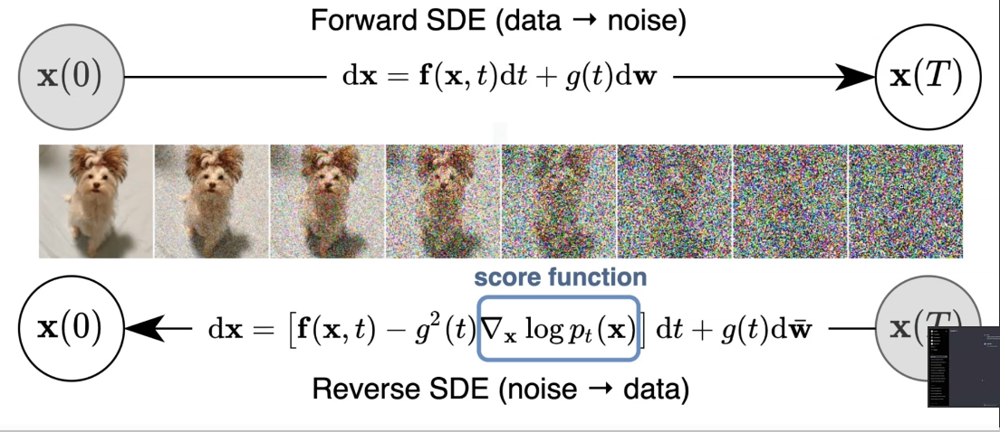

# Diffusion mastery course

## What are diffusion models?
Diffusion models are a class of generative models that are based on the diffusion process. The diffusion process is a process that describes how a system evolves over time. In the context of generative models, the diffusion process is used to model the distribution of data. The idea is to start with a simple distribution, such as a Gaussian distribution, and then apply a series of transformations to it to gradually transform it into the target distribution. The key insight behind diffusion models is that the process of transforming a simple distribution into a complex distribution can be done in a reversible way, which allows us to generate samples from the target distribution by starting with samples from the simple distribution and applying the reverse transformations.

in a layman's terms, Diffusion models are a type of AI that generate images from text descriptions by starting with a noisy, random image and refining it step-by-step. Through this gradual "diffusion" process, the model removes the noise in a way that aligns with the given description, resulting in a clear and detailed image. These models have learned to generate realistic and high-quality images, capturing intricate details based on vast amounts of training data, making them very effective in creative applications like art generation and visual design.

## Content
* [Some Diffusion models Available](./some_diffusion_models.md)
* [Prompt engineering](./Prompt_enginneering.md)
* [Prompt Engineering in Stable Diffusion](./prompt_stable_diffusion.md)
* [Aspect Ratios](./aspect_ratios.md)
* [chatGPT and Dall-e](./chatgpt_dalle.md)
* [Stable Diffusion](./stable_difusion.md)
* [Fooocus UI](./Fooocus_ui.md)

## References an copyrigths
This is a summary, for reference of the course [Diffusion Mastery: Flux, Stable Diffusion, Midjourney & more](https://www.udemy.com/course/diffusion-mastery-flux-stable-diffusion-midjourney-more), ministred by [`Arnold Oberleiter`](https://www.udemy.com/user/arnold-oberleiter/) at [`Udemy`](https://www.udemy.com/). The original content is protected by copyright and all rights are reserved to the author.
