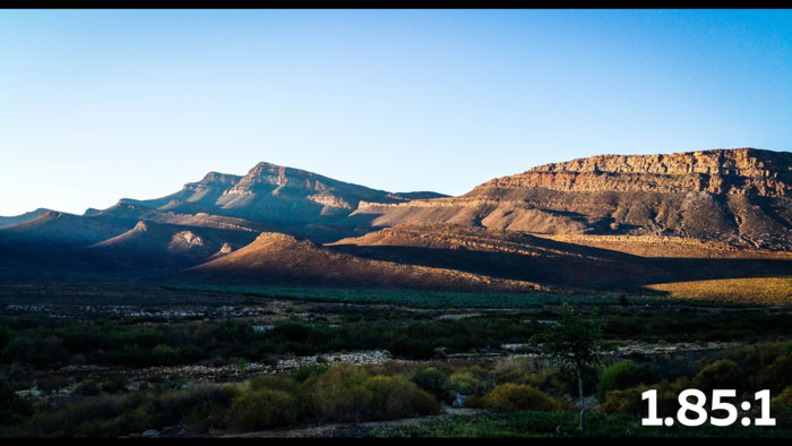

# Aspect Ratios

Aspect ratio is the ratio of the width to the height of an image. It is an important aspect of image composition and can be used to create different visual effects. Here are some common aspect ratios and their uses

## 1:1
The square aspect ratio is often used for social media posts and profile pictures. It is a balanced and symmetrical aspect ratio that works well for images that need to be cropped to a square shape.\

## 4:3 or 1.33:1
The 4:3 aspect ratio is a standard aspect ratio for television and computer screens. It is a more square shape than the 16:9 aspect ratio and is often used for older films and television shows.\

## 16:9 or 1.78:1
The 16:9 aspect ratio is the standard aspect ratio for high-definition television and computer screens. It is a widescreen aspect ratio that is commonly used for movies, television shows, and online videos, like youtube, vimeo and others.\

## 9:16
The 9:16 aspect ratio is a vertical aspect ratio that is commonly used for mobile phone screens and social media stories. It is a tall and narrow aspect ratio that works well for portrait-oriented images and videos, like instagram stories, tiktok and others.\

## 1.85:1
The 1.85:1 aspect ratio is a common aspect ratio for movies. It is slightly wider than the 16:9 aspect ratio and is often used for films that are intended to be shown in theaters.\

## 21:9 Ultrawide Screen
The 21:9 aspect ratio is an ultrawide aspect ratio that is commonly used for computer monitors and gaming screens. It provides a wider field of view than the standard 16:9 aspect ratio and is ideal for immersive gaming and multimedia experiences.\

## 2.35:1 Cinemascope
The 2.35:1 aspect ratio, also known as Cinemascope, is a widescreen aspect ratio that is commonly used for movies. It provides an even wider field of view than the 16:9 aspect ratio and is often used for epic and panoramic shots.\

## 2.39:1 Anamorphic
The 2.39:1 aspect ratio is an anamorphic aspect ratio that is commonly used for movies. It provides an even wider field of view than the 16:9 aspect ratio and is often used for epic and panoramic shots.\

## 2.76:1
The 2.76:1 aspect ratio is an ultra-wide aspect ratio that is commonly used for movies. It provides an even wider field of view than the 16:9 aspect ratio and is often used for epic and panoramic shots.\

## Film Aspect Ratios

Here are a few movies that have unusual aspect ratios so you can get some inspiration:
* Napoleon (1927) is in a 4:1 aspect ratio.
* How the West Was Won (1962) was originally projected in a 2.59:1 aspect ratio and 2.89:1 in newer releases.
* Interstellar (2014) uses a wider aspect ratio to represent how big the space is and smaller aspect ratios for interior or smaller room shots.
* The Lighthouse (2019) was filmed in 1.19:1.
* The Suicide Squad (2021) is in a 1.90:1 aspect ratio.

## Best aspect ratios for social media videos
| Platform | Content-Type       | Resolution aspect Ratio       |
|----------|--------------------|-------------------------------|
| Facebook | Facebook Posts     | Full HD, UHD - 1:1 or 16:9 |
|          | Facebook stories   | Full HD, UHD - 9:16 |
| Instagram | Instagram feed   | Full HD - 1:1 or 4:5 |
|           | Instagram stories and IGTV | Full HD - 16:9 |
| TikTok     | TikTok Short-form | Full HD - 9:16 or 1:1 |
|            | TikTok Ads | Full HD | 9:16, 1:1 or 19:6 (but 9:16 looks best)|
| Twitter(X) | Twitter video posts | Full HD - 16:9 or 1:1 |
| LinkedIn   | LinkedIn posts | Full HD - 1:1 or 16:9 |
|            | LinkedIn stories | Full HD - 9:16 |
| YouTube    | YouTube uploads | Full HD, UHD, FUHD - 16:9 |
|            | YouTube shorts | Full HD, UHD, FUHD - 9:16 |

This is compilation of the original articles: 

[Common Aspect Ratios in Film and TV Production: Which Aspect Ratio Should I Use?](https://borisfx.com/blog/what-is-aspect-ratio-common-aspect-ratios/)\
[What is an Aspect Ratio? Understanding and Common Aspect Ratios](https://www.digitalsamba.com/blog/video-aspect-ratio)

[BACK](./README.md)