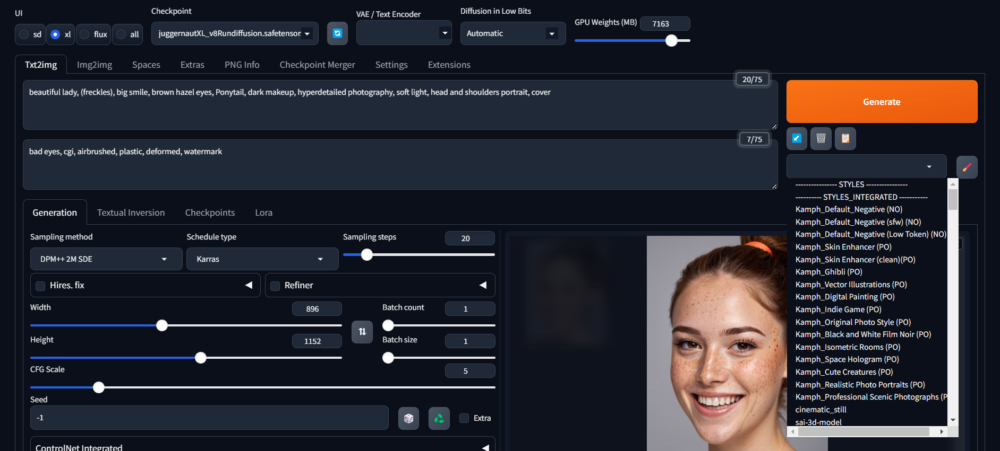

# Forge UI

Forge UI is a user interface that allows you to generate images from text descriptions using Flux models or Stable Diffusion models. Its interface is very similar to Automatic 1111. It is a very simple and easy to use interface that you can use to generate images with Flux models or Stable Diffusion models.

Donwnload [Forge UI on GitHub](https://github.com/lllyasviel/stable-diffusion-webui-forge)

## Forge UI interface

In Forge UI there is a lot of settings that you can use to generate images. 

Every model has its own setting, read the documentation of the model you want to use to know how to use it.

Altrough it is a diferent interface, the settings are very similar to the ones in Automatic 1111 and [Fooocus](./Fooocus_ui.md). So you can use similar settings to generate images.
the diference between Automatic 1111, Fooocus and Forge, is that Forge allow you to use [Flux Models](./flux_models.md) and [Stable Diffusion](./stable_difusion.md) models, while the other interfaces(except [ConfyUI](./Confy_ui.md)) only allow you to use only Stable Diffusion models.

So as [Fooocus](./Fooocus_ui.md) is more simple and easy to use, start with it, and then go to Forge to see the diferences and how to use the Flux models and Stable Diffusion models.

## Forge on Colab
https://colab.research.google.com/github/RedDeltas/SDForge-Colab/blob/main/RedDeltasSDForge.ipynb

## Upscaling images
[Upscale images](./assets/forge_upscaling_1.png)
Send to extra tab to upscale images
[Upscale images Extra tab](./assets/forge_upscaling_2.png)
upscaler: `SwinIR 4x` this is a good upscaler, but you can use any other upscaler that you want.
**GFPGAN: if you are upscaling faces**

## Inpainting images
[Inpainting images](./assets/forge_impainting_1.png)

**NOTE: The teacher did not gave to much attention to Forge, neither do I. Although you can play with it. My personal focus is in Fooocus, that is easy and powerfull and Confy Ui that is ther more complex ui but it is that will give more control to do more complex things**