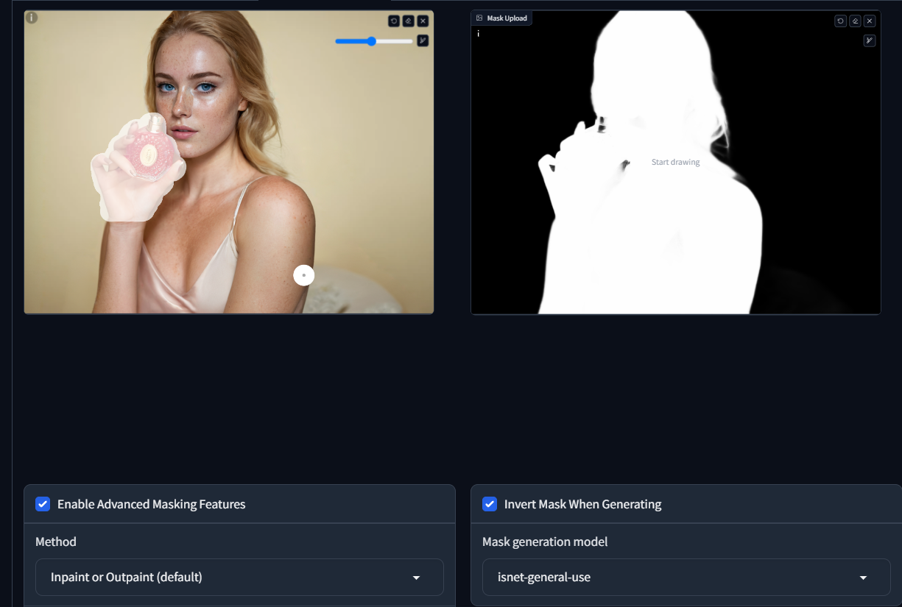
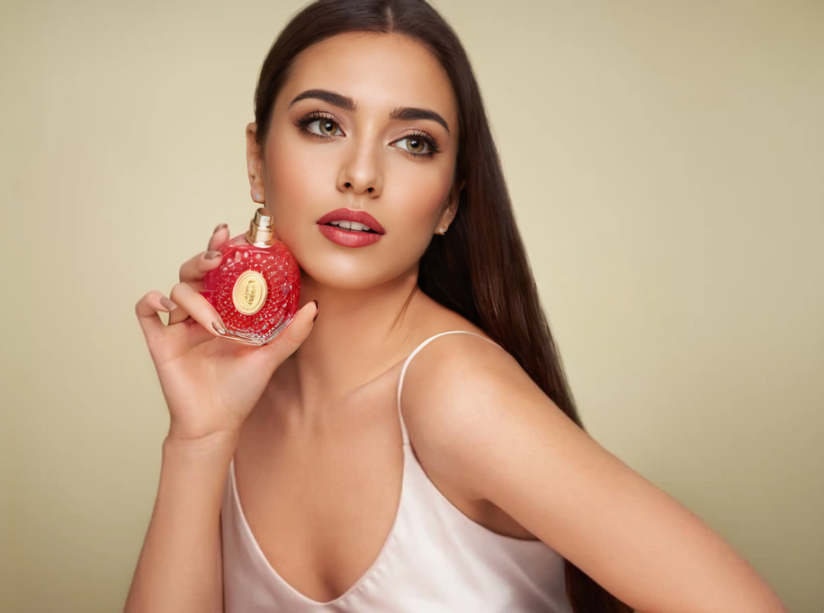
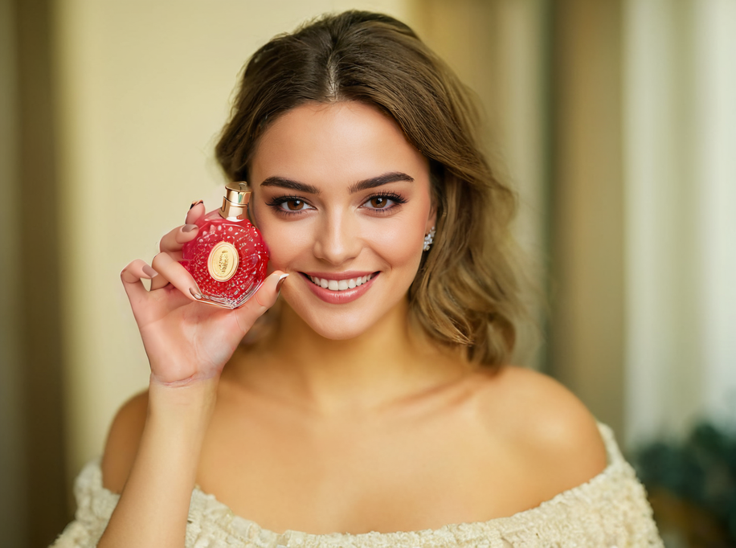

# Object Placement

Let's supose you have a very good image of a person holding a flask of perfume, but you want to change the person to a different one.
Here is how you can do it.

First let's put the image at `inpainting` at the `image` checkbox, select `Enable advanced masking features`, select the area that you want to maintain, at the mask options, select `inverting mask when generating`, then generate the mask.

At the positive prompt, you can use the following `hyperdetailed photography of a beautiful lady, big smile, brown hazel eyes, loose hair, dark makeup, soft light medium shot shot`

at the negative prompt, you can use the `bad eyes, cgi, airbrushed, plastic, deformed, watermark`

Then you can generate the image.

| Original                                     | With our char                                  | The new prompt                                        |
| -------------------------------------------- | ---------------------------------------------- | ----------------------------------------------------- |
|  |  |  |

You can see that the person was changed to a different one, but the flask of perfume and the hand was maintained.