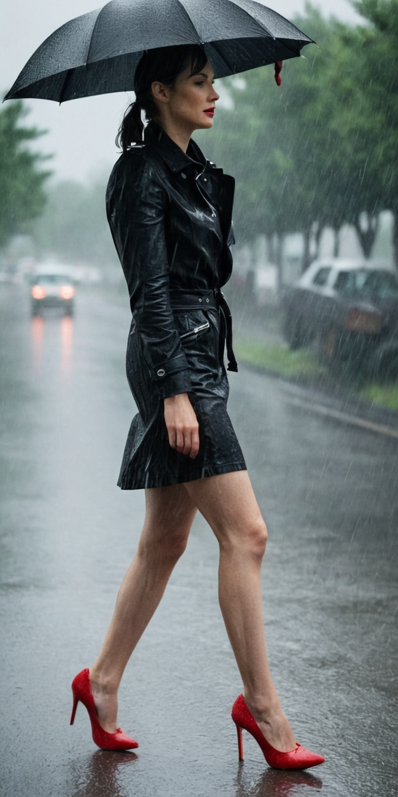
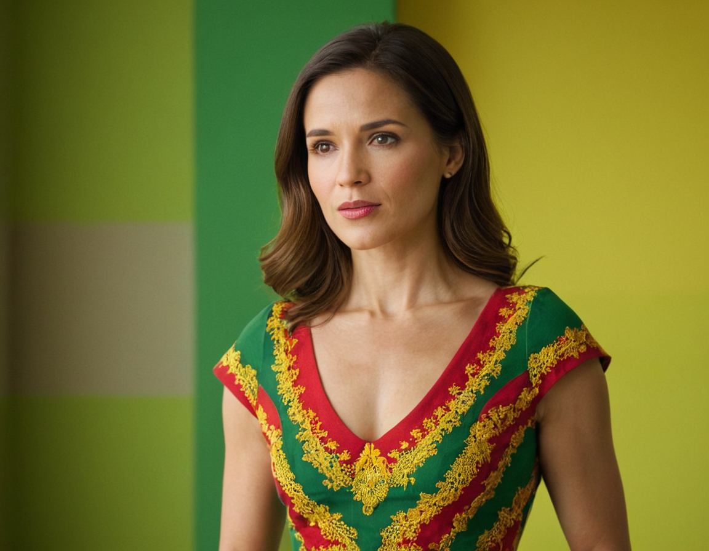
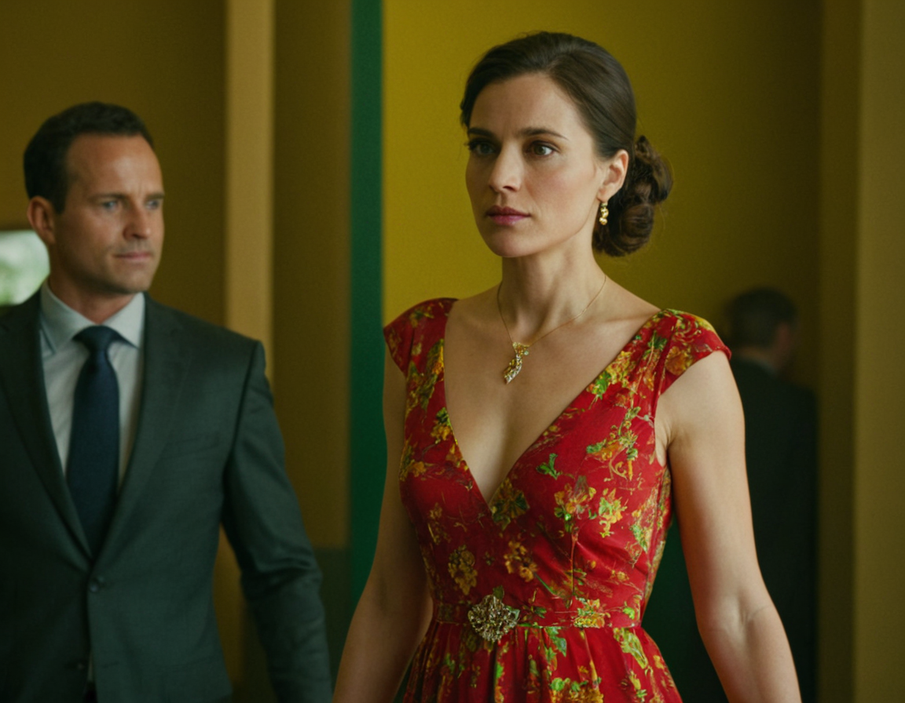
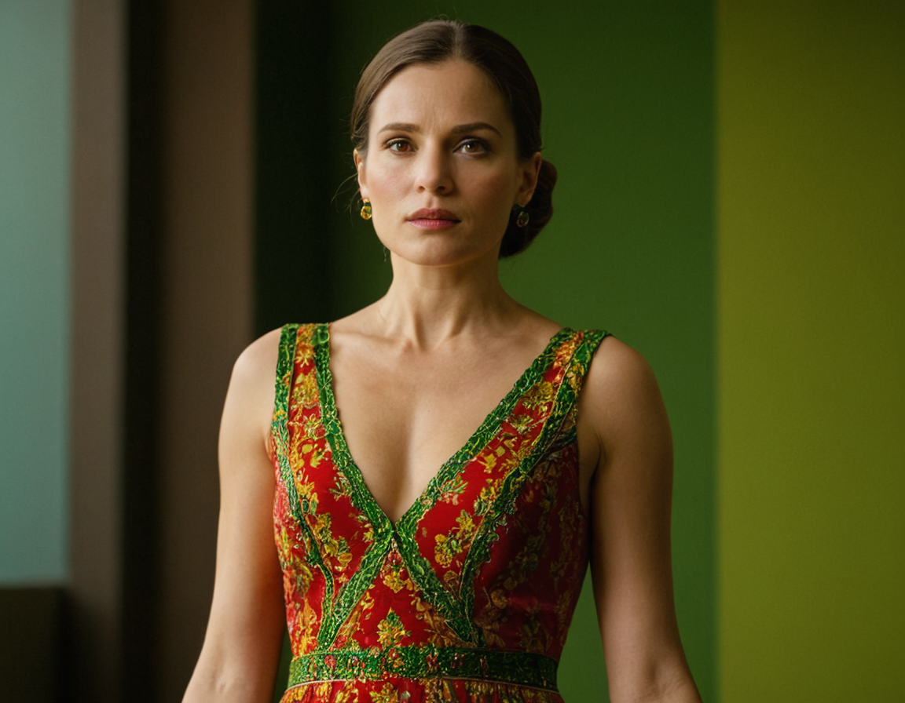
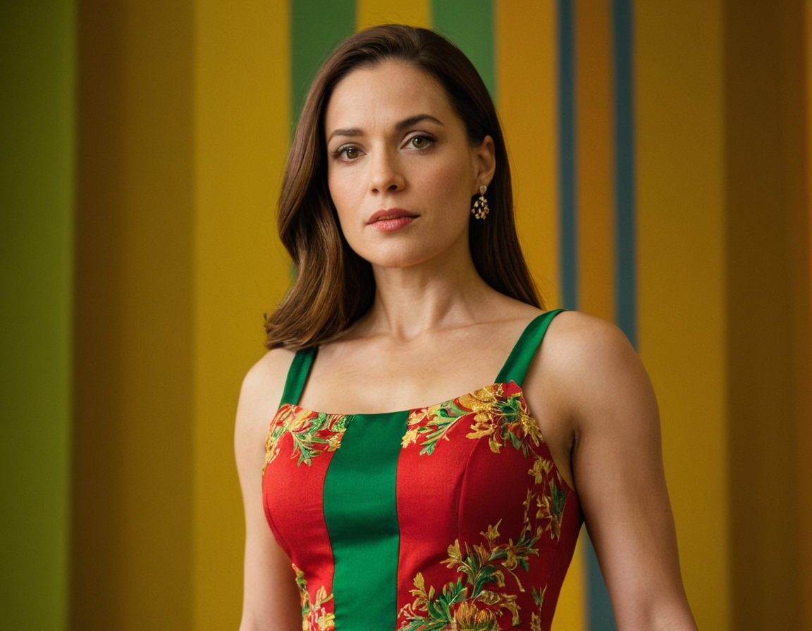
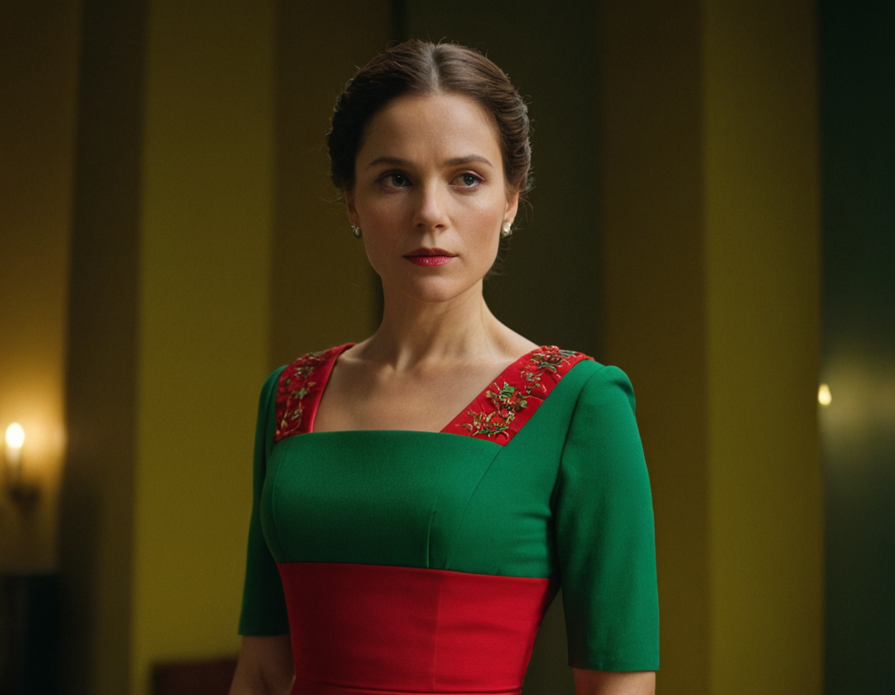
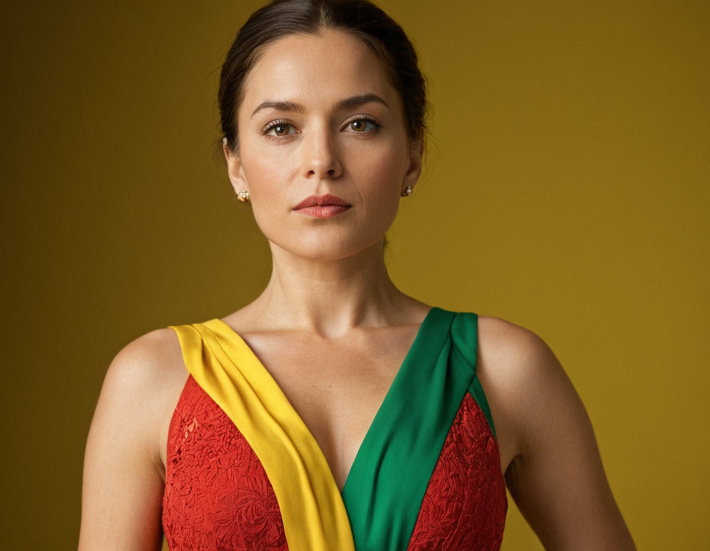
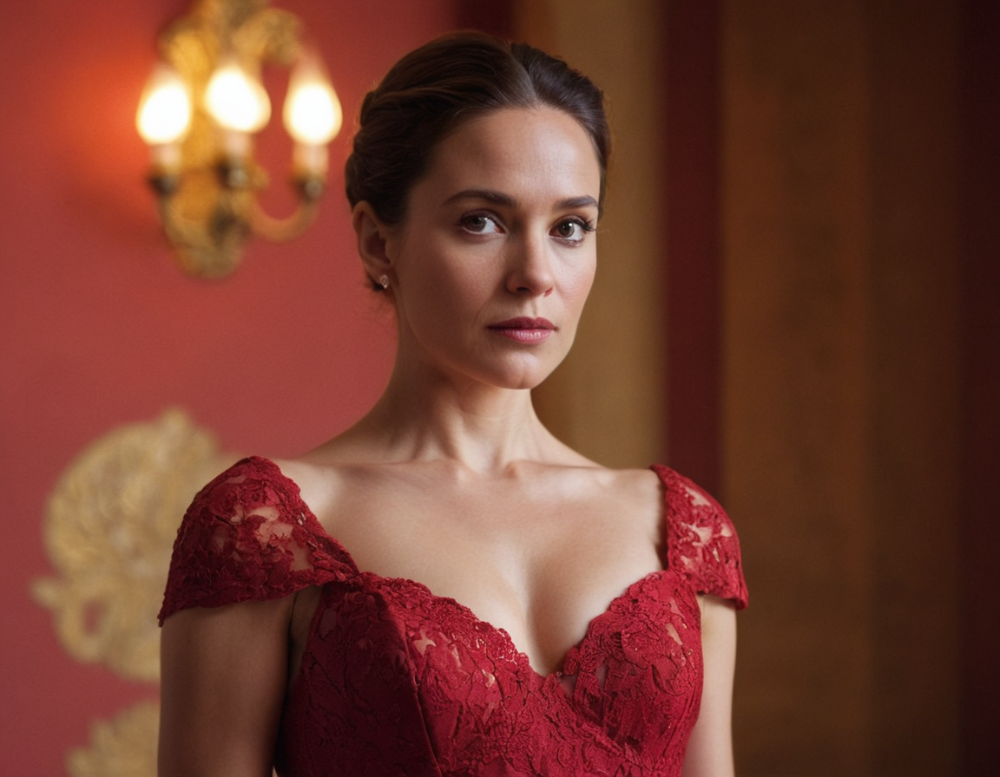
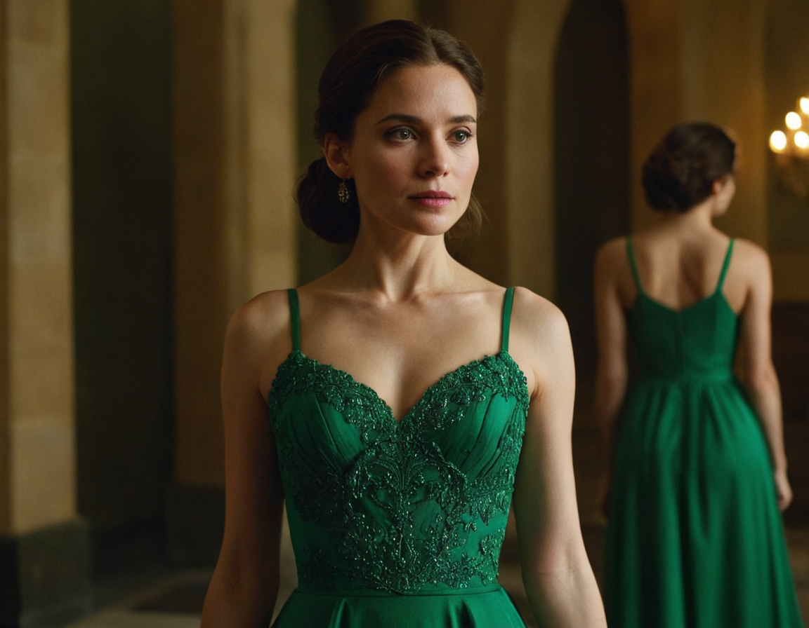
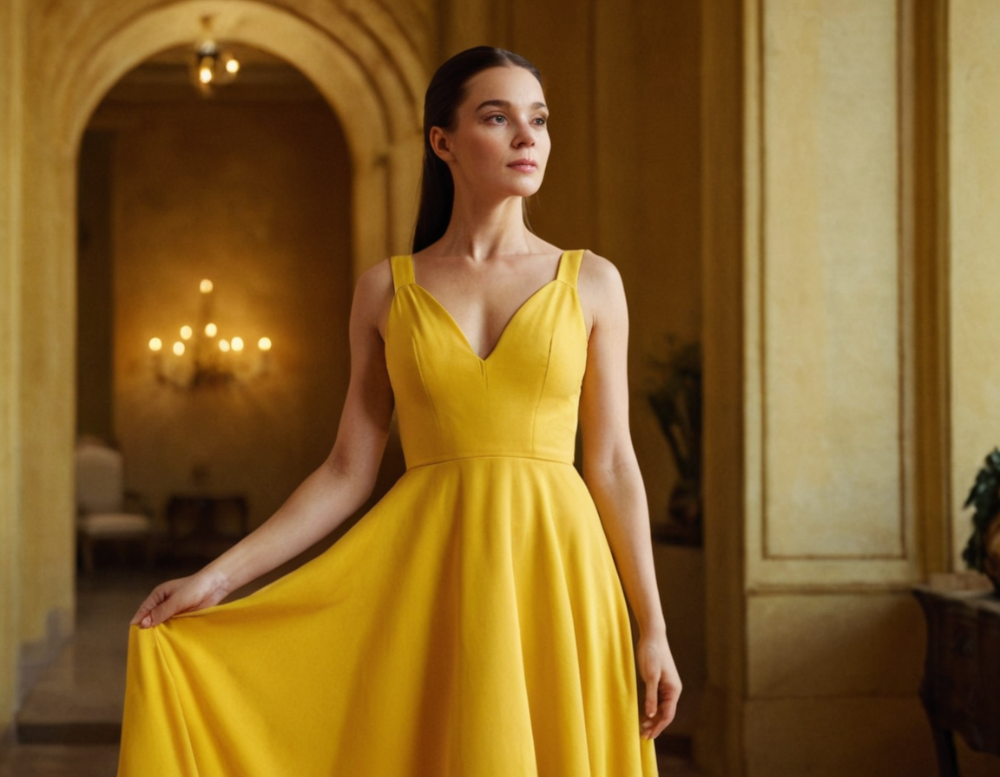

# Prompt Engineering in Stable Diffusion
The proccess to generate images with Stable Diffusion is very similar than between other IA models, so the [Prompt Engineering Basics](./Prompt_enginneering.md) are the same, but there are some differences that you need to know.

In stable diffusion we have the basic prompt +:
* Negative prompt
* Brackets

Example of a prompt in Stable Diffusion:
`photo of a woman, in the park, sunny, colorful, cinematic, in autumn`

let's break it down:
* `photo of` is the medium of the image
* `a woman` is the main subject or theme of the image
* `in the park` is the location of the image, the Setting of the image and the context of the image
* `sunny` is the light of the image
* `colorful` is the color of the image,
* `cinematic` is the style of the image
* `in autumn` is also describing the light, color and some details of the image like the clothes the woman may be wearing.

## Negative prompt
The negative prompt is a way to tell the IA what you don't want in the image. You can use the negative prompt by typing in the negative prompt box. The negative prompt is a list of words that you don't want in the image. For example, if you don't want a cat in the image, you can type "cat" in the negative prompt box.

now let's add a negative prompt to improve the image: `ugly, handy, blurry, bad eyes,  bad anatomy, out of frame`

considering the same seed: `2602659284643670310`. Let's see how this prompt will generate the images:

|  |  |
|---|---|
|  |  |

You can see that the negative prompt has improved the image by removing the unwanted elements from the image.

## Brackets
Brackets is a way to tell the IA to give more or less importance to a word in the prompt. You can use brackets by typing the word in the brackets, followed by a value, between 0,1 and 2. For example, if you want to give more importance, this value should be greater than 1, if you want to give less importance, this value should be less than 1.

**NOTE:** Negative prompts also accept brackets. In both, values greater than 1.5 or less than 0.6 are less recommended, as they can give you a more different image than you expect.

Example of a prompt with brackets:
We will generate three images with the same prompt, but with different values in the brackets, giving more importance to the word `winter` in the prompt.

the first image has the folling prompt: `photo of a woman, in the park, sunny, colorful, cinematic, in winter`
a second image has the same prompt but with brackets: `photo of a woman, in the park, sunny, colorful, cinematic, in (winter:1.2)`
a third image has the same prompt but with a higher value in the brackets: `photo of a woman, in the park, sunny, colorful, cinematic, in (winter:1.5)`
with the same negative prompt: `ugly, handy, blurry, bad eyes,  bad anatomy, out of frame`

considering the same seed: `2602659284643670311`. Let's see how this prompt will generate the images:

|  |  |  |
|---|---|---|
|  |  |  |

You can see that the brackets have improved the image by giving more importance to the word `winter` in the prompt, letting the image expess more the winter season more densely in each image as the value of the brackets increases.

## Sample of good prompts
Here are some examples of good prompts that you can use to generate images with Stable Diffusion:
* **For full body views** (includes some details of the shoes to force the model to generate a full body view) and the right aspect ratio: \
    prompt:`cinematic photo of a woman, walking in the rain, full body view, red shoes, high-resolution, soft skin texture, Canon EOS-1D X Mark II` \
    negative prompt: `Naked, Nude, fake eyes, deformed eyes, bad eyes, cgi, 3D, digital, airbrushed` \
    Aspect ratio: `1:2(704X1408)` \
    

* also, you can check in the [prompt hero](https://prompthero.com/stable-diffusion-prompts), [Lexica](https://lexica.art/), [Seaart](https://www.seaart.ai/) and [Leonardo IA](https://app.leonardo.ai/) for more examples of good prompts with desired results.

## Link to the instructor ChatGPT prompt generator for Stable Diffusion
https://chatgpt.com/g/g-n7srX5zrf-prompts-fur-sdxxl

## Multiline prompts
You can use multiline prompts to generate images with Stable Diffusion. This is useful when you want to generate images that merges two or more concepts.

The proccess for multiline prompts is that the IA will alternate for each step of the diffusion process between the two prompts, generating an image that merges the two prompts.

Let's see an example of a multiline prompt

1. first image prompt: 
`photo of a turtle on the beach`
`photo of a colorful parot on the beach`

2. second image prompt: 
`photo of a (turtle:0.8) on the beach`
`photo of a (colorful parot:1.2) on the beach`

3. third image prompt: 
`photo of a (turtle:0.9) on the beach`
`photo of a (colorful parot:1.1) on the beach`

negative prompt for all images: `blurry, out of frame, extra limbs, poor composition, low resolution, cartoonist, overexposed, grainy, deformed, low quality, dull colors`

now let's see the result of this prompt with the a random seed:

|  |  |  |
|---|---|---|
|  |  |  |

As you can see, the multiline prompt has generated images that merge two concepts, the turtle and the parot, in a single image.

## Arrays or Square brackets

You can use arrays to generate images with Stable Diffusion. This is useful when you want to generate images that have multiple objects or concepts.

The proccess for arrays is that the IA will generate an image for each element in the array, generating multiple images with the same prompt but with different objects or concepts.

Let's see an example of prompt without array using the folloing prompt:
`a woman in a red, green, yellow dress`
and the negative prompt: `blurry, out of frame, extra limbs, poor composition, low resolution, cartoonist, overexposed, grainy, deformed, low quality, dull colors`

|  |  |  |
|---|---|---|
|  |  |  |

as you can see, the IA has generated 3 images with the same prompt with the 3 colors on the dress.

Now let's see an example of prompt with array using the same prompt, but with the colors in an array:\
new prompt: `a woman in a [red, green, yellow] dress`

|  |  |  |
|---|---|---|
|  |  |  |

Now you can see that the IA has generated 3 images with the same prompt with the 3 colors on the dress, but now the colors seens to be more separated in the dress.
 
 

Lastly, let's see an example of prompt with array using the same prompt, but with the colors in an **double** array:\
new prompt: `a woman in a [[red, green, yellow]] dress`

|  |  |  |
|---|---|---|
|  |  |  |

Now you can see that the IA has generated 3 images with only one color on the dress, 1 image per color in the double array.

### Array conclusion
You can use arrays to generate multiple images with the same prompt but with different objects or concepts. You can use single arrays to generate multiple images with the same prompt but with different objects or concepts in the same image(not full sure about that, but you can try), and you can use double arrays to generate multiple images with the same prompt but with different objects or concepts in different images.

[BACK](./README.MD)