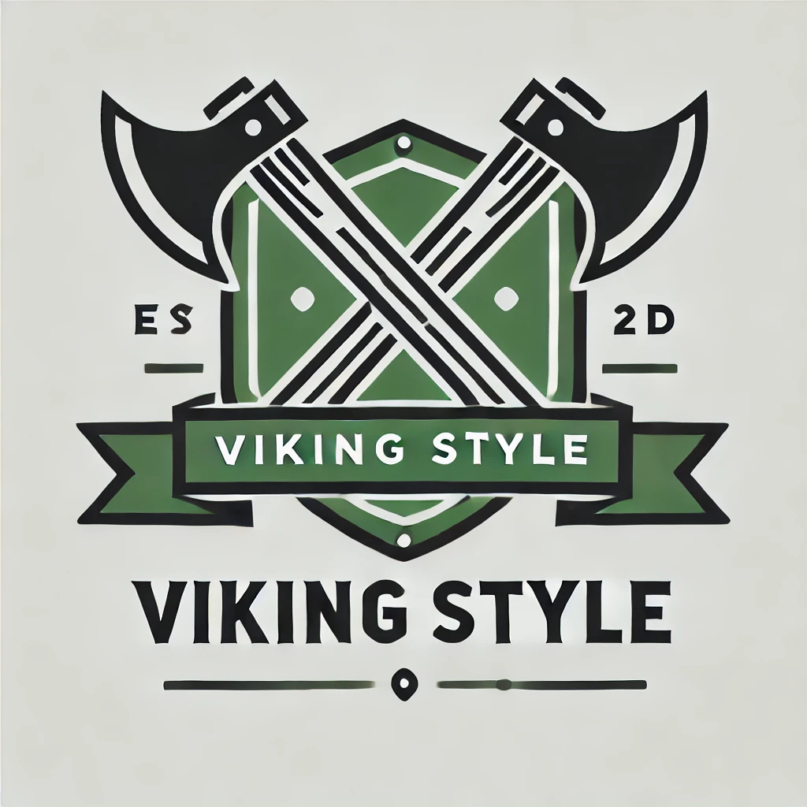
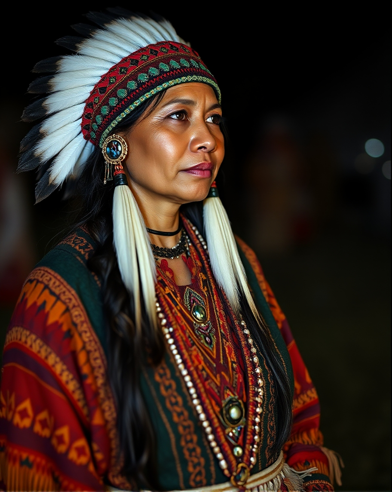

# Some diffusion Models
This is a list of some diffusion models and their differences and applications.

## Dall-E
Dall-e is a model from OpenAI that generates images from text. It is based on the diffusion model.
This model is good model for logos or things similar to that.

example:
prompt: `make a black and green flat 2d logo, crossed axes and a shield eith letters "VIKING STYLE"`
Prompt generated at https://chatgpt.com

## MidJorney
MidJorney is a model from the homonimous company that generates images from text. It is based on the diffusion model.
This model is good model for photo-realistic images.

example:
prompt: `A native american woman with native clothes, at night `

Prompt generated at https://www.imagine.art/

## Adobe Firefly
Adobe Firefly is a model from Adobe that generates images from text. It is based on the diffusion model.
This model is a more generic model that can generate images from text, but not so good at realistic images as MidJorney. Firefly also is very good because it`s integrated with Adobe Creative Cloud and can be used in Adobe Photoshop, Illustrator and other Adobe products.

https://firefly.adobe.com/

## Stability IA
Stability IA is a model from the homonimous company that generates images from text. It is based on the diffusion model.
Stability IA make the stable diffusion models. Stalbe diffusion models are open source and can be used in any project.
Could run locally or in the cloud.

https://stability.ai/

## Flux
Flux is a model from the Black Forest Labs company that generates images from text. It is based on the diffusion model.
Flux also is a open source model and can be used in any project. At this momment is one of the best AI models for generating images from text.
Could run locally or in the cloud.

https://flux-ai.io/

## Leonardo IA
Leonardo IA is a model from the Leonardo Interactive Pty Ltd company that generates images from text. It is based on the diffusion model.

https://leonardo.ai/

## Ideogram
Ideogram is a model from the homonimous company that generates images from text. It is based on the diffusion model.

https://ideogram.ai/

## ElevenLabs
ElevenLabs is an Diffusion model that generates speech from text. It is based on the diffusion model.

https://elevenlabs.io/

## Udio
Udio is a diffusion model that generates music from text. It is based on the diffusion model.

https://www.udio.com/

## AlphaFold
AlphaFold is a model from DeepMind that predicts protein folding. It is based on the diffusion model.
This is only for reference, because it is not a image, video or sound generation model, but is realy cool and important for the scientific community.

https://alphafold.ebi.ac.uk/

## ComfyUI
This is a GUI for modulating the diffusion models. It is a open source project that can be used in any project.
We can use Models from Stability IA, Flux, in ComfyUI.

[BACK](./README.md)